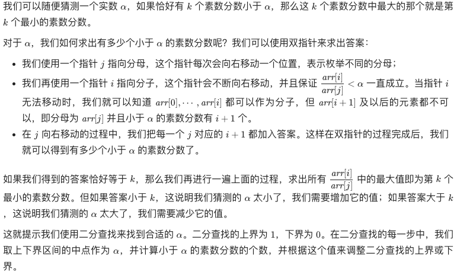
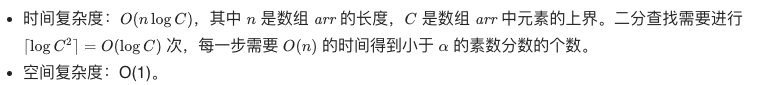

# 二分搜索套路框架

**二分查找**：从有序的数组中查找目标值target的下标。

如果有序数组中存在多个目标值 target 元素，那么这些元素是挨在一起的，这里就涉及到算法应该返回最左侧的那个target元素下标，还是最右侧的那个target 元素下标。也就是所说的 **搜索左侧边界** 和 **搜索右侧边界**。


```java
//搜索左侧边界
int left_bound (int [] nums, int target) {
    int left = 0, right = nums.length-1;
    while (left<right) {
        int mid = left + (right-left)/2;
        if (nums[mid] == target) {
            //找到target时，收缩右侧边界
            right = mid;
        }
        else if (nums[mid] < target) {
            left = mid+1;
        }
        else if (nums[mid] > target) {
            //注意，这个地方时设置右指针为 mid 而不是 mid-1
            right = mid;
        }

    }
    return left;
}
```

```java
//搜索右侧边界
int right_bound (int [] nums, int target) {
    int left = 0, right = nums.length-1;
    while (left<right) {
        int mid = left + (right-left)/2;
        if (nums[mid] == target) {
            //找到target时，收缩左侧边界
            left = mid+1;
        }
        else if (nums[mid] < target) {
            left = mid+1;
        }
        else if (nums[mid] > target) {
            //注意，这个地方时设置右指针为 mid 而不是 mid-1
            right = mid;
        }

    }
    return left-1;
}
```


**二分搜索问题的泛化**

```java
// 函数 f 是关于自变量 x 的单调递增函数
int f(int x, int[] nums) {
    return nums[x];
}

int left_bound(int[] nums, int target) {
    if (nums.length == 0) return -1;
    int left = 0, right = nums.length;
    
    while (left < right) {
        int mid = left + (right - left) / 2;
        if (f(mid, nums) == target) {
            // 当找到 target 时，收缩右侧边界
            right = mid;
        } else if (f(mid, nums) < target) {
            left = mid + 1;
        } else if (f(mid, nums) > target) {
            right = mid;
        }
    }
    return left;
}
```


**总结：**

```java
// 函数 f(x) 时关于x 的单调函数
int f(int x) {
    ...
}


//主函数，在 f(x) == target 的约束下求 x 的最值。
int solution(int [] nums, int target) {
    if (nums == null || nums.length == 0) {
        return -1;
    }
    
    //f(x) :自变量x 的最小值是什么
    int left = ...;
    //f(x) :自变量x 的最大值是什么
    int right = ...+1;
    while (left < right) {
        int mid = left + (right-left)/2;
        if (f(mid) == target) {
            //题目要求的时左边界还是右边界
            ...
        }
        else if(f(mid) < target) {
            // 怎么能让 f(x) 大一点
            ...
        }
        else if(f(mid) > target) {
            // 怎么能让 f(x) 小一点
            ...
        }
    }
    return left;
}
```

[786. 第 K 个最小的素数分数](https://leetcode.cn/problems/k-th-smallest-prime-fraction/
)

* 思路：



* 复杂度分析：




- [x] 33搜索旋转排序数组

- [x] 34在排序数组中查找元素的第一个和最后一个位置

- [x] 35搜索插入位置

- [ ] 69x的平方根

- [ ] 74搜索二维矩阵

- [ ] 153寻找旋转排序数组中的最小值

- [ ] 162寻找峰值

- [ ] 275H指数II

- [ ] 278第一个错误的版本

- [ ] 287寻找重复数

- [ ] 875

- [ ] 1011

- [ ] 剑指 Offer II 073. 狒狒吃香蕉

- [ ] 410.分割数组的最大值

  

  
