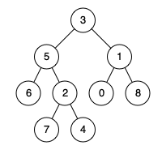

# 重提二叉树的重要性
* 快速排序本质上是一个二叉树前序遍历
  * 快婿排序是先将一个元素排好序，然后再将剩余的元素排好序。
* 归并排序本质上是一个二叉树后续遍历
  * 先把左半边树排序好了，再把右半边数组排序好，然后两半数组合并。

#二叉树的刷题思路
前序、中序、后续遍历是处理每一个节点的三个时间点，如下图。


二叉树的所有问题，就是让在前中后序位置注入代码逻辑，去达到自己的目的，你只需要单独思考每一个节点应该干什么，二叉树的遍历会递归在每一个节点上做相同的操作。
主要思路有两类：

1. 是否可以通过遍历一遍二叉树得到答案？如果可以，用一个 traverse 函数配合外部变量来实现，这叫「遍历」的思维模式。
2. 是否可以定义一个递归函数，通过子问题（子树）的答案推导出原问题的答案？如果可以，写出这个递归函数的定义，并充分利用这个函数的返回值，这叫「分解问题」的思维模式。

无论使用哪种思维模式，你都需要思考：
如果单独抽出一个二叉树节点，它需要做什么事情？需要在什么时候（前/中/后序位置）做？其他的节点不用你操心，递归函数会帮你在所有节点上执行相同的操作。

366.二叉树的叶子节点


# 二叉树（构造篇）

二叉树的构造问题一般都是使用 **分解问题** 的思路： **构造整棵树 = 根节点 + 构造左子树 + 构造右子树**

例如：654


# 二叉树序列化
前序遍历、后序遍历、层序遍历都可, 但中序不遍历不行，因为
中序遍历无法 deserialize

例如 
* [297](https://leetcode.cn/problems/serialize-and-deserialize-binary-tree/)

# 二叉搜索树
1. 如果当前节点会对下面的子节点有整体影响，可以通过辅助函数增长参数列表，借助参数传递信息。
2. 在二叉树递归框架之上，扩展出一套 BST 代码框架：

```
void BST(TreeNode root, int target) {
    if (root.val == target)
    // 找到目标，做点什么
    if (root.val < target)
    BST(root.right, target);
    if (root.val > target)
    BST(root.left, target);
}
```
3. 根据代码框架掌握了 BST 的增删查改操作。


# N叉树的遍历

```
void traverse(TreeNode root) {
  for (TreeNode child: children) {
    traverse(child);
  }
}

```

# 最近公共父节点 LCP
## LeetCode 1676. 二叉树的最近公共祖先 IV
题目
```text
给定一棵二叉树的根节点 root 和 TreeNode 类对象的数组（列表） nodes，返回 nodes 中所有节点的最近公共祖先（LCA）。
数组（列表）中所有节点都存在于该二叉树中，且二叉树中所有节点的值都是互不相同的。

我们扩展二叉树的最近公共祖先节点在维基百科上的定义：“对于任意合理的 i 值， n 个节点 p1 、 p2、…、 pn 在二叉树 T 中的最近公共祖先节点是后代中包含所有节点 pi 的最深节点（我们允许一个节点是其自身的后代）”。

一个节点 x 的后代节点是节点 x 到某一叶节点间的路径中的节点 y。
```


示例 1:
在这里插入图片描述


```
输入: root = [3,5,1,6,2,0,8,null,null,7,4], nodes = [4,7]
输出: 2
解释: 节点 4 和 7 的最近公共祖先是 2。
```

示例 2:
在这里插入图片描述


```
输入: root = [3,5,1,6,2,0,8,null,null,7,4], nodes = [1]
输出: 1
解释: 单个节点的最近公共祖先是该节点本身。
```

示例 3:
在这里插入图片描述


```
输入: root = [3,5,1,6,2,0,8,null,null,7,4], nodes = [7,6,2,4]
输出: 5
解释: 节点 7、6、2 和 4 的最近公共祖先节点是 5。
```

示例 4:


```
输入: root = [3,5,1,6,2,0,8,null,null,7,4], nodes = [0,1,2,3,4,5,6,7,8]
输出: 3
解释: 树中所有节点的最近公共祖先是根节点。
```
```text

提示:
树中节点个数的范围是 [1, 10^4] 。
-10^9 <= Node.val <= 10^9
所有的 Node.val 都是互不相同的。
所有的 nodes[i] 都存在于该树中。
所有的 nodes[i] 都是互不相同的。

```

## LeetCode 1644. 二叉树的最近公共祖先 II
给定一棵二叉树的根节点 root，返回给定节点 p 和 q 的最近公共祖先（LCA）节点。
如果 p 或 q 之一不存在于该二叉树中，返回 null。
树中的每个节点值都是互不相同的。

根据维基百科中对最近公共祖先节点的定义：“两个节点 p 和 q 在二叉树 T 中的最近公共祖先节点是后代节点中既包括 p 又包括 q 的最深节点（我们允许一个节点为自身的一个后代节点）”。
一个节点 x 的后代节点是节点 x 到某一叶节点间的路径中的节点 y。

示例 1:


```
输入： root = [3,5,1,6,2,0,8,null,null,7,4], p = 5, q = 1
输出： 3
解释： 节点 5 和 1 的共同祖先节点是 3。
```

示例 2:


```
输入： root = [3,5,1,6,2,0,8,null,null,7,4], p = 5, q = 4
输出： 5
解释： 节点 5 和 4 的共同祖先节点是 5。根据共同祖先节点的定义，一个节点可以是自身的后代节点。
```

示例 3:


```
输入： root = [3,5,1,6,2,0,8,null,null,7,4], p = 5, q = 10
输出： null
解释： 节点 10 不存在于树中，所以返回 null。
 
提示:
树中节点个数的范围是 [1, 104]。
-109 <= Node.val <= 109
所有节点的值 Node.val 是互不相同的。
p != q
```

## 1650. 二叉树的最近公共祖先 III（哈希）

题目:

给定一棵二叉树中的两个节点 p 和 q，返回它们的最近公共祖先节点（LCA）。

每个节点都包含其父节点的引用（指针）。Node 的定义如下：

```text
class Node {
    public int val;
    public Node left;
    public Node right;
    public Node parent;
}
```

根据维基百科中对最近公共祖先节点的定义：“两个节点 p 和 q 在二叉树 T 中的最近公共祖先节点是后代节点中既包括 p 又包括 q 的最深节点（我们允许一个节点为自身的一个后代节点）”。

一个节点 x 的后代节点是节点 x 到某一叶节点间的路径中的节点 y。

示例 1:



```
输入: root = [3,5,1,6,2,0,8,null,null,7,4], p = 5, q = 1
输出: 3
解释: 节点 5 和 1 的最近公共祖先是 3。
```

示例 2:


```
输入: root = [3,5,1,6,2,0,8,null,null,7,4], p = 5, q = 4
输出: 5
解释: 节点 5 和 4 的最近公共祖先是 5，根据定义，一个节点可以是自身的最近公共祖先。

示例 3:
输入: root = [1,2], p = 1, q = 2
输出: 1
 
提示:
树中节点个数的范围是 [2, 10^5]。
-109 <= Node.val <= 109
所有的 Node.val 都是互不相同的。
p != q
p 和 q 存在于树中。
```