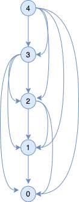
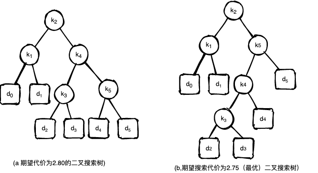
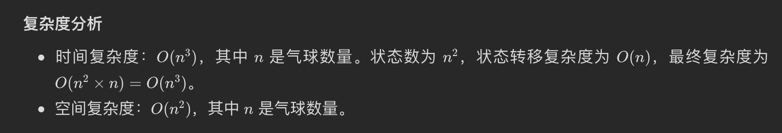
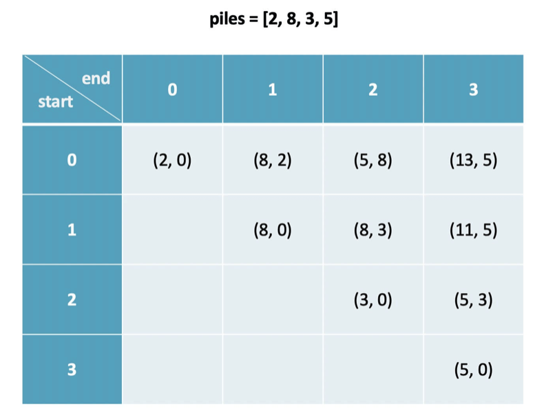
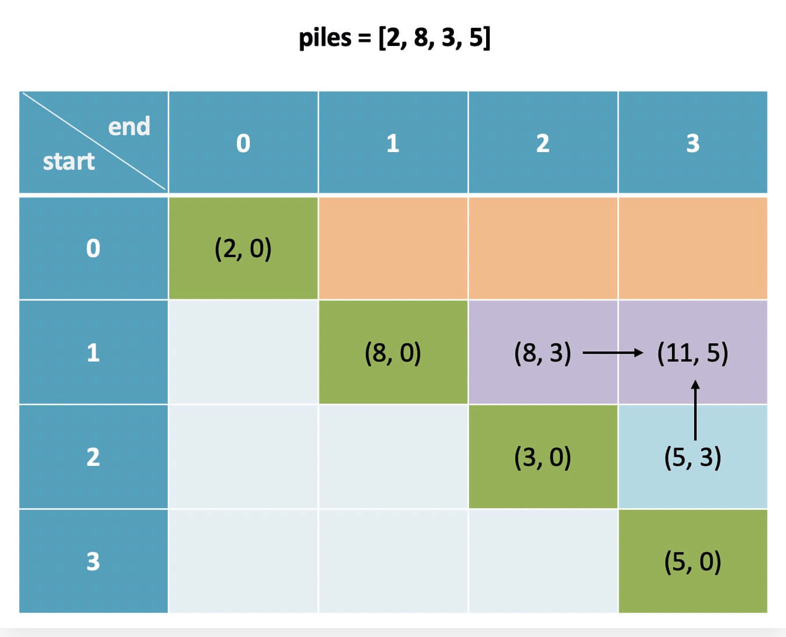
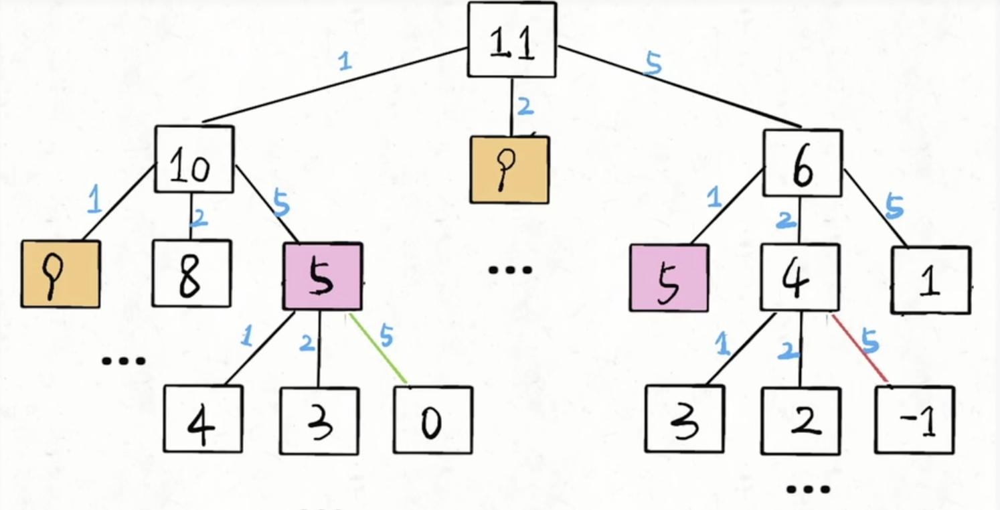

# 问题1 剪绳子

## 1.问题描述

一根长为n的钢条，将其切成段钢条出售，切割工序本身没有成本，给出最佳的切割方案。假定出售一段长度为i英寸的钢条的价格为$p_i$ $i = 1,2,...$ 钢条长度均为整数。

价格表如下:

| 长度$i$   | 1    | 2    | 3    | 4    | 5    | 6    | 7    | 8    | 9    | 10   |
| --------- | ---- | ---- | ---- | ---- | ---- | ---- | ---- | ---- | ---- | ---- |
| 价格$p_i$ | 1    | 5    | 8    | 9    | 10   | 17   | 17   | 20   | 24   | 30   |

## 2.解决方案

### 使用动态规划方法求解最优钢条切割问题.

> 动态规划方法思想:
>
> 朴素的递归调用算法之所以低效，是因为它反复求解相同的子问题。因此，动态规划方法仔细安排求解顺序，对每个子问题只求解一次，并将结果保存下来。如果再次需要计算此子问题的解，只需超着保存的结果。而不必重新计算。
>
> 因此，动态规划方法是付出额外的保存空间来节省计算时间，是典型的时空权衡（time-memory trade-off）的例子。而时间上的节省可能是非常巨大的：可能将一个指数时间的解转化为一个多项式时间的解。
>
> 如果子问题的数量是输入规模的多项式函数，而我们可以在多项式时间内求解出每个子问题，那么动态规划方法总运行时间就是多项式的。

### 动态规划有两种等价实现方式

* 带备忘的自顶向下法（top-town with memoization）

  ```
  MEMOIZED_CUT_ROD(p, n)
  	let r[0...n] be a new array
  	for i = 0 to n
  		r[i] = $-\infty$
  	return MEMOIZED_CUT_ROD_AUX(p, n, r)
  MEMOIZED_CUT_ROD_AUX(p, n, r)
  	if r[n] >= 0
  		return r[n]
  	if n = 0
  		q = 0
  	else q = $-\infty$
  		for i = 1 to n:
  			q = max(q, p[i] + MEMOIZED_CUT_ROD_AUX(p, n-i, r))
  	r[n] = q
  	return q
  ```

    * 主过程MEMOIZED_CUT_ROD首相初始化r[0...n]为$-\infty$ ，这是一种常见的初始化方式，（已知收益均为非负值），然后调用辅助过程MEMOIZED_CUT_ROD_AUX
    * 过程MEMOIZED_CUT_ROD_AUX是最初的CUT_ROD引入了备忘机制，如果r[0...n]中已经计算出了该子问题，则直接返回；否则用通用的方法计算出q，并将q存入r中

* 自底向上法（botom-up method）

  ```
  BOTTOM_UP_CUT_ROT(p, n)
  	let r[0...n] to be new Array
  	r[0] = 0
  	for j = 1 to n
  		q = $-\infty$
  		for i = 1 to j
  			q = max(q, p[i] + r[j-1])
  		r[j] = q
  	return r[n]
  
  ```


* 自底向上版本BOTTOM_UP_CUT_ROT采用子问题的自然顺序：若i< j,则规模为i的子问题比规模为j的规模更小。因此，过程一次求解规模为 j = 0,1,...,n

* #### 算法时间复杂度分析

  两种方法的复杂度都是 $\Theta( n^{2})$

## 3.子问题图

当思考一个动态规划问题时应该弄清楚所设计的子问题和子问题的之间的依赖关系。



图中表示 n = 4时，钢条切割子问题图。顶点表示子问题的规模，有向边$(x,y)$ 表示求解子规模问题 $x$ 时需要子问题 $y$ 的解。

## 4. 重构解

前面钢条切割问题返回最优解的收益值，但并未返回切割方案（一个长度为n的列表，给出每段切割的长度）。采用扩展的动态规划算法，使之对每个子问题不仅保存最优收益值，还保存对应的切割方案。

下面给出BOTTOM-UP-CUT-ROD的扩展版本，它对长度为j的钢条不仅计算最大收益$r_j$ 还保存最优解对应的每一段钢条的切割长度$s_j$

```
EXTEND-BOTTOM-UP-CUT-ROD(p, n)
	let r[0...n] and s[0...n] be new arrays
	r[0] = 0
	
	for j = 1 to n
		q = $-\infty$
		for i = 1 to j
			if q < p[i] + r[j-i]
				q = p[i] + r[j-i]
				s[j] = i
			r[j] = q
	return r and s
```

此过程和BOTTOM_UP_CUT_ROT差异很小，差别只是在开创建了一个数组s[0...n]，并在求解规模为j的子问题中在s中保存了切割方案。

下面过程接受两个参数价格表p和钢条长度n，然后调用EXTEND-BOTTOM-UP-CUT-ROD来计算切割下来的每段钢条的长度s[1...n]，最后输入长度为n的钢条的完整的最优切割方案：

```
PRINT-CUT-ROD-SOLUTION(p, n)
	(r, s) = EXTEND-BOTTOM-UP-CUT-ROD(p, n)
	while n>0:
		print(s[n])
		n = n-s[n]
```

# 问题2 矩阵链乘法

## 1.问题描述

矩阵链相乘问题。给出一个$n$ 个矩阵的$<A_1,A_2,...,A_n >$ 计算他们的乘积 $A_1A_2...A_n$ 。

为了计算 $A_1A_2...A_n$，我们可以先用括号明确计算次序，然后利用标准的矩阵相乘的方法进行计算。由于矩阵乘法满足结合律，因此任何加括号的方法都会得到相同的结果。

我们称有如下性质的矩阵乘积链为**完全括号化**（fully parenthesized）：它是一个单一矩阵，或者是有两个完全括号化的矩阵乘积链的积，且已经外加括号。

例如如果矩阵链为$<A_1,A_2,A_3,A_4 >$，则它共有5种完全括号化的矩阵乘积链，分别如下： $$
(A_1(A_2(A_3A_4)))\\(A_1((A_2A_3)A_4))\\((A_1A_2)(A_3A_4))\\((A_1(A_2A_3)A_4))\\(((A_1A_2)A_3)A_4))
$$ 矩阵链乘法问题（matrix-chain multiplication problem）可描述如下：

给定$n$ 个矩阵的链 $<A_1,A_2,...,A_n >$ ，矩阵 $A_i$ 的规模为 $p_{i-1}*p_i(1\leqslant i \leqslant n)$ ，求完全括号化方案，使得计算乘积 $A_1A_2...A_n$
所需标量计算的乘法次数最少。

## 2.计算括号化方案的数量

$$ P(n)=\begin{cases} 1 &,&n=1 \\ {\sum\limits_{k=1}^{n-1}{ P(k)P(n-k))}} &,&n\geqslant 2 \end{cases} $$

括号化方案的数量与 $n$ 呈指数关系 $\Omega(2^n)$ 。

## 3.动态规划求解矩阵链乘法的最优括号化方案

* 刻画一个最优的结构特征；
* 递归地定义最优解的值；
* 计算最优解的值，通常采用自底向上的方法；
* 利用计算出的信息构造一个最优解。

我们依旧按照上述四个步骤求解。

### **步骤1、刻画一个最优的结构**

我们用符号 $A_{i,j}（i \leqslant j）$ 表示 $A_iA_{i+1}...A_j$ 乘积的结果矩阵。如果问题是非平凡的，即 $i<j$ ，为了对 $A_iA_{i+1}...A_j$ 进行括号化，我们必须在某个
$A_k$ 和 $A_{k+1}$ 之间划分开，其中 $k$ 为 $i \leqslant k <j $ 之间的整数。也就是说，对某个整数 $k$ ,首先计算 $A_{i,k}$ 和 $A_{k+1,j}$ ，然后再计算它们的乘积得到
$A_{i,k}$ 。此方案的复杂度为矩阵 $A_{i,k}$ 的计算代价 + $A_{k+1,j}$ 的计算代价 + $A_{i,k}$ 与 $A_{k+1,j}$ 的乘积的计算代价。

下面给出最优子结构。

假设的最优括号化方案分割点在 $A_k$ 和 $A_{k+1}$ 之间，那么

* 对于前缀子链 $A_i...A_k$ 进行括号化时，我们应该直接采用独立求解它们时所得的最优方案。

  这样做是什么原因？

  如果不采用独立求解 $A_i...A_k$ 所得的最优化方案来进行括号化，可以将此最优解代入 $A_iA_{i+1}...A_j$ 的最优解中，代替原来对子链进行括号化的方案（ 比$A_i...A_k$
  最优解的代价更高），这样得到的解比原来最优解代价更低；产生矛盾。

* 对于后缀子链 $A_{k+1}...A_j$ 也是同样的道理。

### **步骤2、递归地求解最优的值**

下面用子问题的最优解来递归地定义原问题最优解的代价。

对矩阵链乘法问题，我们可以将对所有 $1 \leqslant i \leqslant j \leqslant n$ 确定 $A_iA_{i+1}...A_j$ 的最小代价括号化方案作为子问题。令 $m[i,j]$ 表示矩阵 $A_
{i,j}$ 所需标量乘法最小值，那么，原问题的最优解——计算 $A_{1...n}$ 的最低代价就是 $m[1,n]$ 。

递归定义 $m[i,j]$ ，对于 $i==j$ 的平凡问题，矩阵链只包含唯一的矩阵 $A_{i,i} = A_i$ 。因此不需要进行标量乘法，所以对于 $i= 1,2,...,n,\;m[i,i]=0$ 。若 $i<j$
,我们采用步骤1得到的最优子结构计算 $m[i,j]$ , 我们假设 ${A_iA_{i+1}...A_j}$ 的最优化括号方案的分割点在矩阵 $A_{k}$和$A_{k+1}$ 之间 ，其中$i\leqslant k < $ j，那么，
$m[i,j]$ 就等于计算 $A_{i...k}$ 和 $A_{k+1...j}$ 代价加上二者相乘的结果，因为矩阵 $A_{i}$ 的大小为 $p_{i-1}\times p_{i} $，易知，$A_{i...k}$ 与 $A_
{k+1...j}$ 的代价为 $p_{i-1}p_{k}p_{j}$ 次标量的乘法。因此得到如下的递归求解公式。 $$ m[i,j]=\left\{\begin{matrix} 0 &,&i=j \\ \min\limits_
{1\leqslant k < n }\{ \;m[\,i...k\,] + m[\,i+1...j\,] + p_{i-1}p_{k}p_{j}\;\} &,&i<j \end{matrix}\right. $$ $m[i,j]$
给出了问题的子问题的最优解代价，但并未提供足够的信息来构造最优解。为此，采用 $s[i,\, j]$ 保存 $A_iA_{i+1}...A_{j}$ 的最优括号化方案的分隔位置 $k$ 。即使得 $m[i,j] = m[i,k] +
m[k+1,j] + p_{i-1}p_kp_j$ 成立的$k$。

### **步骤3、计算最优解代价**

```
MATRIT_CHAIN_ORDER(p):
	let m[1..n, 1...n], s[1...n-1,2...n] be new Array
  for i=0 to n
  	m[i,i] = 0
  for l=2 to n
  	for i = 1 to n-l+1
  		j = i+l-1
  		A[i,j] = ∞
  		for k = i to j
  			q = m[i,k] + m[k+1,j] + $p_{i-1} p_{k} p_{j}$
  			if q< m[i,j]
  				m[i,j] = q
  				s[i,j] = s
  return m, s

```

### **步骤4、构造最优解**

```
PRINT_OPTION_PARENS(s, i, j)
	if i = j
		PRINT "A"i
	else
		PRINT "("
		PRINT PRINT_OPTION_PARENS(s, i, s[i,j])
		PRINT PRINT_OPTION_PARENS(s, s[i,j]+1, j)
		PRINT ")"
```

# 动态规划原理

## 1. 什么情况下适合动态规划

使用动态规划求解最优解问题应该具备两个特征

* 最优子结构
* 子问题重叠

## 2. 最优子结构

**通用模式**

* 证明问题最优解的第一个组成部分是做出一个选择，例如，选择钢条切割第一切割的位置，选择矩阵链的划分位置。做出这个选择会产生一个或多个待解的子问题。
* 对于一个给定的问题，其可能的第一步选择中，你假定已经知道了哪种选择才会得到最优解，你现在并不关心这种选择具体是如何得到的，只是知道了这种选择。
* 给定可获得最优解的选择后，你确定这次选择会产生哪些子问题，以及如何最好地刻画子问题的空间。
* 利用“剪贴-粘贴”（cut-and-paste）的技术证明：作为构成原问题最优解的组成部分，每个子问题的解就是他本身的最优解。（可以采用反证法证明。）

## 3. 重叠子问题

## 4. 重构最优解

## 5. 备忘

# 问题3 最长公共子序列

一个给定序列的**子序列（subsequence）**，就是将给定的序列中零个或者多个元素去掉后得到的结果。其形式化定义如下：

给定序列 $X = <x_1,x_2,...,x_n>$ ，另一个序列 $X = <z_1, z_2, ... , z_k>$ 满足如下条件时称为 $Z$ 的子序列（subsequence)    ，即存在一个严格递增的下标序列 $<
i_1, i_2, ...,i_k> $ 对所有的 $j =1, 2, ..., k$ 满足 $x_{i_{j}} = z_j$ 。

**最长公共子序列问题（longest-common-subsequence problem，LCS）** 给定两个序列 $X = <x_1,x_2,...,x_m>$ 和 $Y=<y_1,y_2,...,y_n>$ , 求 $X$ 和
$Y$ 的最长公共子序列。

例如：$X= <A,B,C,B,D,A,B>$, $Y = <B,D,C,A,B,A>$ ，$<B,C,B,A>$ 是一个最长公共序列，其长度为4，$<B,D,A,B>$ 也是X，Y的最长公共序列。但是 $<B,D,A>$
不是因为它的长度为3。

**下面采用动态规划高效地求解LCS问题**

暴力法求子串复杂度为指数阶。

## **步骤1**： 寻找一个最优子结构

* **前缀**

  给定一个序列$X = <x_1,x_2,...,x_m>$ ，对 $i=0,1,...,m$ ，定义X的第 $i$ 个前缀是 $X_i= <x_1, x_2, ...,x_i>$ ，例如$X= <A,B,C,B,D,A,B>$,
  $X_4= <A,B,C,B>$ , $X_0 = 0$。

* **定理3.1（LCS的最优子结构）**

  **给定两个序列 $X = <x_1,x_2,...,x_m>$ 和 $Y=<y_1,y_2,...,y_n>$ ，$Z=<z_1,z_2,...,z_k>$ 为$X$ 和$Y$ 的任意LCS,**

    * **如果 $x_m= y_n$ ，则 $x_m = y_n = z_k$ ,且 $Z_{k-1}$ 是 $X_{m-1} $ 和 $X_{n-1}$ 的一个LCS；**
    * **如果 $x_m \neq y_n$ ，那么 $x_m \neq z_k$ 意味着 $Z$ 是 $X_{m-1}$ 和 $Y$ 的一个LCS；**
    * **如果 $x_m \neq y_n$ ，那么 $y_m \neq z_k$ 意味着 $Z$ 是 $X$ 和 $Y_{n-1}$ 的一个LCS。**

* 定理3.1 可知，两个序列的LCS包含两个序列前缀的LCS。因此具有LCS问题具有最优子结构的性质。下面我们也可以看到具有重叠子问题的性质。

## **步骤2**：递归定义最优解

定义$c[i,j]$ 表示 $X_{i}$ 和 $Y_{j}$ 的LCS的长度。 $$ c[i,j]=\begin{cases} 0 &,& i=0 \,或\, j=0 \\ c[i-1,j-1]+1 &,& i,j>0,且x_{i} =
y_{j} & (3.1)\\ \max(c[i-1,j],c[i,j-1]) &,& i,j>0，且x_{i} \neq y_{j} \end{cases} $$

## **步骤3:**  计算LCS的长度

从式3.1可可以容易写出一个复杂度为指数级的地方方法。

由于共有 $\Theta (m*n)$ 个子问题，我们采用动态规划自底向上的的算法求解。

LCS_LENGTH(X, Y)接受两个参数 $X = <x_1,x_2,...,x_m>$ 和 $Y=<y_1,y_2,...,y_n>$ ，它将 $c[i,j]$ 的值保存在 $c[0...m,0...n]$
中，并按主次序（row-major-order） 计算表项，（即首先计算从左到右计算第一行，再算第二行，依此类推），过程中维护了 $b[1...m,1...n]$ 保存了表项对应计算 $c[i,j]$
时所选择的最优解。过程返回表b，表c，$c[m,n]$ 保存了LCS的长度。

```
LCS_LENGTH(X, Y)
	m = X.length, n = Y.length
	let b[1...m,1...n] and c[0...m,0...n] be new Array
	for i = 1 to m
		c[i,0] = 0
	for j = 1 to n
		c[0,j] = 0
	for i = 1 to m
		for j = 1 to n
			if x_i == y_j
				c[i,j] = c[i-1][j-1] + 1
				b[i,j] = ↖
			elif c[i-1,j] >= c[i,j-1]
				c[i,j] = c[i-1,j]
				b[i,j] = ⬆
			else 
				c[i,j] = c[i,j-1]
				b[i,j] = ⬅
		return c, b
```

## 步骤4: 构造LCS

```
PRINT_LCS(b, X, i, j)
	if i== 0 or j == 0
		return
	if b[i,j] == ↖
		PRINT_LCS(b, X, i-1, j-1)
		print x[i]
	elseif b[i,j] == ⬆
		PRINT_LCS(b, X, i-1, j)
	else 
		PRINT_LCS(b, X, i, j-1)
```

* 算法时间复杂度 $O（m+n）$

## 算法改进

可以完全去掉 表b，因为c[i,j] 只依赖于表c中的其他三项，c[i-1,j-1] , c[i-1,j], c[i,j-1] 。给定 c[i,j] 的值，我们可以在 O(1) 的时间内判断出计算c[i,j] 时用了哪3项。

# 问题4 最优二叉搜索树

最优二叉搜索树（Optimal binary search tree）问题，形式化定义：给定一个n个不同关键字的已排序的序列 $K= <k_1,k_2,\cdots,k_n>,(k_1<k_2<\cdots <k_n)$
,我们希望用这些关键字构建一棵树。对于每个关键字 $k_i$ ，都有一个概率 $p_i$ 表示搜索频率。有些要搜索的值可能不在 $K$ 中，因此我们还有$n+1$ 个“伪关键字” $d_0,d_1,\cdots,d_{n}$ 表示不在
$K$中的值。其中，$d_0$ 表示所有小于 $k_1$ 的值，$d_n$ 表示所有大于 $k_n$ 的值，$d_i\;(1\leqslant i \leqslant n-1)$ 表示所有在 $k_i$,和$k_{i+1}$
之间的值。对于每个“伪关键字”都有一个概率$q_i$ 表示对应的搜索频率。每个关键字$k_i$时一个内部结点，而每个伪关键字$d_i$
是一个叶结点。每次搜索关键字要么成功（找到了某个关键字$k_i$），要么失败（找到某个伪关键字$d_i$），因此:
$$ \sum_{i=1}^{n} p_i + \sum_{i=0}^{n}q_i = 1 \tag{4.1} $$ 例如，下表显示对于一个n=5个关键字的集合构成的二叉搜索树

对于一个n=5的关键字集合集如下的搜索该概率构造的两棵二叉搜索树。



| i | 0 | 1 | 2 | 3 | 4 | 5 | | :----: | :--: | :--: | :--: | :--: | :--: | :--: | | $p_i $ | | 0.15 | 0.10 | 0.05 |
0.10 | 0.20 | | $q_i$ | 0.05 | 0.10 | 0.05 | 0.05 | 0.05 | 0.10 |

我们知道每个关键字和伪关键字的搜索概率，因而可以确定在一棵给定的二叉搜索树T中进行一次搜索的期望代价。假定一次搜索的代价等于访问的结点个数，即此搜索树找到结点在T中的深度加1。那么在T中进行一次搜索的期望代价为： $$
\begin{align} E\left [ T中搜索代价 \right ]  &= \sum\limits_{i=1}^{n}{(depth_{T}(k_{i})+1) \cdot p_i } + \sum\limits_
{i=0}^{n}{(depth_{T}(d_{i})+1) \cdot q_i } \\&=1 + \sum\limits_{i=1}^{n}{depth_{T}(k_{i}) \cdot p_i } + \sum\limits_
{i=0}^{n}{depth_{T}(d_{i}) \cdot q_i } \end{align} \tag{4.2} $$ 对于一个给定的概率集合，我们希望构造一棵期望搜索代价最小的二叉搜索树，我们称之为最优二叉搜索树。

## 步骤1 最优二叉树的结构

特征：考虑二叉搜索树的任意子树。它必须包含连续关键字 $k_i, \cdots, k_j\;,1\leqslant i \leqslant j \leqslant n $ ,而且其叶结点必然是伪关键字 $d_{i-1},\cdots,d_
{j}$ 。

二叉搜索树的最优子结构：如果一棵最优二叉搜索树 $T$ 有一棵包含关键字 $k_i, \cdots, k_j $ 的子树 ${T}'$ ,那么 ${T}'$ 必然包含关键字 $k_i, \cdots, k_j $ 和伪关键字 $d_
{i-1},\cdots,d_{j}$ 的子问题的最优解。

> * 可以采用反正法证明
>
> 如果存在 $T{''} $ ，其期望搜索代价比 $T{'}$ 低，那么我们将 $T{'}$ 从 $T$ 中删除，然后把 $T{''} $ 粘贴到相应的位置，从而得到一颗期望搜索代价低于 $T$ 的最优二叉搜索树，这与假设相矛盾。

> * 利用最优子结构性质证明，我们可以利用子问题的最优解构造原问题的最优解。
>
> 给定关键字序列 $k_i, \cdots, k_j $ ，其中某个关键字，比如 $k_r(i \leqslant r \leqslant j)$ 是这些关键字的根结点。那么 $k_r$ 的左子树就包含关键字 $k_i, \cdots, k_{r-1} $ （和伪关键字 $d_{i-1},\cdots,d_{r-1}$）及包含关键字 $k_{r+1}, \cdots, k_j $ (和伪关键字 $d_{r},\cdots,d_{j}$)。只要我们检查了所有可能的根结点 $k_r(i \leqslant r \leqslant j)$ ，并对每种情况分别求解包含 $k_i, \cdots, k_{r-1} $ 及包含 $k_{r+1}, \cdots, k_j $ 的最优二叉树，即可保证找到原问题的最优解。

这里有一个细节——空子树。假定对于包含关键字 $k_i, \cdots, k_j $ 的子问题，我们选定 $k_i$ 为根结点。根据前面论述，$k_i$ 的左子树就包含关键字 $k_i, \cdots, k_{i-1} $
。我们将此序列解释为不包含任何关键字。但子树中仍包含伪关键字。按照惯例，我们认为关键字 $k_i, \cdots, k_{i-1} $ 不包含任何关键字，但包含单一伪关键字 $d_{i-1}$。对称地，如果选择 $k_j$
作为根基点，那么它的右子树包含关键字 $k_{j+1},\dots,k_j$ ——此右子树不包含任何实际关键字，但包含伪关键字 $d_j$。

## 步骤2 一个递归算法

选取的子问题域：求解包含关键字 $k_i, \cdots, k_j $ 的最优二叉搜索树，其中 $i\geqslant 1,j \leqslant n 且 j \geqslant i-1$ (当 $j=i-1$
时，子树不包含实际的关键字，只包含伪关键字 $d_{i-1}$ )。定义 $e[i,j]$ 为在包含关键字 $k_i, \cdots, k_j $ 的最优二叉树中进行一次搜索的期望代价。最终希望计算出$e[1,n]$。

* 当将 $j = i-1$ 是，由于子树只包含了伪关键 $d_{i-1}$ ，期望搜索代价为 $e[i,i-1]=q_{i-1}$ 。

* 当 $j \geqslant i$ 时，从 $k_i, \cdots, k_j $ 选择一个结点作为根结点 $k_r$ ，然后构造一棵包含关键字 $k_i, \cdots, k_{r-1} $ 的最优二叉树作为其左子树，包含关键字$k_
  {r+1}, \cdots, k_{j} $ 的最优二叉树作为其右子树。当一棵树成为了一个结点在子树时，期望搜索代价如何变化？由于每个结点的深度都增加了1，根据公式(4.2），这颗子树的概率增加值应该为所有的概率之和。对于包含关键字
  $k_i, \cdots, k_{r-1} $ 的子树，所有的概率之和为 $$ w(i,j) = \sum \limits_{l=i}^{j} p_l + \sum\limits_{l=i}^{j}q_l \tag{4.3} $$

因此，若 $k_r$ 为包含关键字 $k_i,\cdots, k_j$ 的最优二叉搜索树的根结点，有如下公式 $$ e[i,j] = p_r + ((e[i,r-1] + w(i,r-1) + (e[r+1,j]+w(r+1,j))
\tag{4.4} $$ 由式(4.3)  $w(i,j) = w(i,r-1) + p_r + w(r+1,j)$

因此， $$ \begin{align} e[i,j] & = p_r + ((e[i,r-1] + w(i,r-1) + (e[r+1,j]+w(r+1,j))\\ &= e[i,r-1] + e[r+1,j] + w(i,j)
\tag{4.5} \end{align} $$ 递归公式（4.5）假定我们知道哪个结点 $k$ 应该作为根结点。如果选取期望代价最低者作为根结点，可得到下面的递推公式 $$ e[i,j] = \begin{cases} q_{i-1}
&,&j=i-1\\ \min \limits_{i \leqslant r \leqslant j}{ e[i,r-1] + e[r+1,j] + w(i,j)} &,&i \leqslant j  
\end{cases}\tag{4.6} $$ $e[i,j]$的值给出了最优二叉搜索树的期望搜索代价。为了记录二叉搜索树的结构，对于包含关键字 $k_i,\cdots,k_j(1\leqslant i \leqslant j
\leqslant n)$ 的最优二叉树，我们定义$root[i,j]$ 保存根结点 $k_r$ 的下表$r$。

## 步骤3 计算最优二叉搜索树的期望搜索代价

* 表 $e[1..n+1,0..n]$ 保存 $e[i,j]$ 的值，

    * 对于只包含伪关键字 $d_n$的子树， 用 $e[n+1,n]$ 保存。
    * 对于只包含伪关键字 $d_0$ 的子树，用 $e[1,0]$保存。

* 表 $root[i,j]，1 \leqslant i \leqslant j \leqslant n$ 记录包含关键字 $k_i, \cdots, k_j $ 的根。

* 表 $w[1..n+1,0..n]$ 保存 $w[i,j]$ ,避免每次计算 $e[i,j]$ 时重新计算 $w(i,j)$

    * $w[i,i-1] = q_{i-1}$
    * 对于 $j\geqslant i$ , $w[i,j] = w[i,j-1] + p_j + q_j \tag{4.7}$

  这样对于 $\Theta(n^2)$ 个 $w[i,j]$ ，每个计算的时间为 $\Theta(1)$ 。

* p 表示概率 $p_0,\cdots,p_n$

* q 表示概率 $q_0,\cdots, q_n$

* n 表示规模$n$

* 返回表e和root

```
OPTIMAL_BST(p,q,n):
	let e[1..n+1, 0..n], w[1..n+1, 0..n] and root[1..n, 1..n] be new tables
	for i = 1 to n+1
		e[i,i-1] = q[i-1]
		w[i,i-1] = q[i-1]
    for l= 1 to n
    	for i = 1 to n-l+1
    		j = i+l-1
    		e[i,j] = ∞
    		w[i,j] = w[i,j-1] + p[j] + q[j]
    		for r = i to j
    			t = e[i,r-1] + e[r+1,j] + w[i,j]
    			if t < e[i,j] 
    				e[i,j] = t
    				root[i,j] = r
	return e and root
```

 与MATRIT_CHAIN_ORDER复杂度一样，运行时间为 $\Theta(n^3)$

## 步骤4 构造而最优二叉树

```
Construct-OPTIMAL-BST(root)
```

# leetcode 题目

## 312. 戳气球

有 n 个气球，编号为0 到 n - 1，每个气球上都标有一个数字，这些数字存在数组 nums 中。 现在要求你戳破所有的气球。戳破第 i 个气球，你可以获得 nums[i - 1] * nums[i] * nums[i + 1] 枚硬币。
这里的 i - 1 和 i + 1 代表和 i 相邻的两个气球的序号。如果 i - 1或 i + 1 超出了数组的边界，那么就当它是一个数字为 1 的气球。 求所能获得硬币的最大数量。

```
示例 1：
输入：nums = [3,1,5,8]
输出：167
解释：
nums = [3,1,5,8] --> [3,5,8] --> [3,8] --> [8] --> []
coins =  3*1*5    +   3*5*8   +  1*3*8  + 1*8*1 = 167
示例 2：

输入：nums = [1,5]
输出：10

提示：

n == nums.length
1 <= n <= 300
0 <= nums[i] <= 100
```

* 思路分析

回溯方法复杂度过高

采用以下动态规划思路

这个动态规划问题和我们之前的动态规划系列文章相比有什么特别之处？为什么它比较难呢？

原因在于，这个问题中我们每戳破一个气球nums[i]，得到的分数和该气球相邻的气球nums[i-1]和nums[i+1]是有相关性的。 我们前文 动态规划套路框架详解
说过运用动态规划算法的一个重要条件：子问题必须独立。所以对于这个戳气球问题，如果想用动态规划，必须巧妙地定义dp数组的含义，避免子问题产生相关性，才能推出合理的状态转移方程。
如何定义dp数组呢，这里需要对问题进行一个简单地转化。题目说可以认为nums[-1] = nums[n] = 1，那么我们先直接把这两个边界加进去，形成一个新的数组points：

```
int maxCoins(int[]nums){
    int n=nums.length;
    // 两端加入两个虚拟气球
    int[]points=new int[n+2];
    points[0]=points[n+1]=1;
    for(int i=1;i<=n;i++){
      points[i]=nums[i-1];
    }
    // ...
}
```

现在气球的索引变成了从1到n，points[0]和points[n+1]可以认为是两个「虚拟气球」。

那么我们可以改变问题：在一排气球points中，请你戳破气球0和气球n+1之间的所有气球（不包括0和n+1），使得最终只剩下气球0和气球n+1两个气球，最多能够得到多少分？ 现在可以定义dp数组的含义： 
 `dp[i][j] = x` 表示，戳破气球i和气球j之间（开区间，不包括i和j）的所有气球，可以获得的最高分数为x。 那么根据这个定义，题目要求的结果就是`dp[0][n+1]`的值，而 base case 就是`dp[i][j] = 0，其中0 <= i <= n+1,
j <= i+1`，因为这种情况下，开区间(i, j)中间根本没有气球可以戳。 
// base case 已经都被初始化为 0 
`int[][] dp = new int[n + 2][n + 2];`
现在我们要根据这个dp数组来推导状态转移方程了，根据我们前文的套路，所谓的推导「状态转移方程」，实际上就是在思考怎么「做选择」，也就是这道题目最有技巧的部分：

不就是想求戳破气球i和气球j之间的最高分数吗，如果「正向思考」，就只能写出前文的回溯算法；我们需要「反向思考」，想一想气球i和气球j之间最后一个被戳破的气球可能是哪一个？

其实气球i和气球j之间的所有气球都可能是最后被戳破的那一个，不防假设为k。回顾动态规划的套路，这里其实已经找到了「状态」和「选择」：i和j就是两个「状态」，最后戳破的那个气球k就是「选择」。
根据刚才对dp数组的定义，如果最后一个戳破气球k，
`dp[i][j]` 的值应该为： 
`dp[i][j] = dp[i][k] + dp[k][j]`

+ points[i]*points[k]*points[j]
  你不是要最后戳破气球k吗？那得先把开区间(i, k)的气球都戳破，再把开区间(k, j)的气球都戳破；最后剩下的气球k，相邻的就是气球i和气球j，这时候戳破k的话得到的分数就是points[i]*points[k]*points[j]。
  那么戳破开区间(i, k)和开区间(k, j)的气球最多能得到的分数是多少呢？嘿嘿，就是dp[i][k]和dp[k][j]，这恰好就是我们对dp数组的定义嘛！

* 实现 leetcode.dp._312_戳气球
  


## 486 预测赢家



下文讲解时，认为元组是包含 `first` 和 `second` 属性的一个类，而且为了节省篇幅，将这两个属性简写为 `fir` 和 `sec`。比如按上图的数据，我们说 `dp[1][3].fir = 11`，`dp[0][1].sec = 2`。

先回答几个读者可能提出的问题：

这个二维 dp table 中存储的是元组，怎么编程表示呢？这个 dp table 有一半根本没用上，怎么优化？很简单，都不要管，先把解题的思路想明白了再谈也不迟。

**以下是对 dp 数组含义的解释：**

`dp[i][j].fir = x` 表示，对于 `piles[i...j]` 这部分石头堆，先手能获得的最高分数为 `x`。

`dp[i][j].sec = y` 表示，对于 `piles[i...j]` 这部分石头堆，后手能获得的最高分数为 `y`。

举例理解一下，假设 `piles = [2, 8, 3, 5]`，索引从 0 开始，那么：

`dp[0][1].fir = 8` 意味着：面对石头堆 `[2, 8]`，先手最多能够获得 8 分；`dp[1][3].sec = 5` 意味着：面对石头堆 `[8, 3, 5]`，后手最多能够获得 5 分。

我们想求的答案是先手和后手最终分数之差，按照这个定义也就是 `dp[0][n-1].fir - dp[0][n-1].sec`，即面对整个 `piles`，先手的最优得分和后手的最优得分之差。

### 二、状态转移方程

写状态转移方程很简单，首先要找到所有「状态」和每个状态可以做的「选择」，然后择优。

根据前面对 `dp` 数组的定义，**状态显然有三个：开始的索引 `i`，结束的索引 `j`，当前轮到的人。**

```python
dp[i][j][fir or sec]
其中：
0 <= i < piles.length
i <= j < piles.length
```

对于这个问题的每个状态，可以做的**选择有两个：选择最左边的那堆石头，或者选择最右边的那堆石头。** 我们可以这样穷举所有状态：

```python
n = piles.length
for 0 <= i < n:
    for j <= i < n:
        for who in {fir, sec}:
            dp[i][j][who] = max(left, right)
```

上面的伪码是动态规划的一个大致的框架，这道题的难点在于，两人足够聪明，而且是交替进行选择的，也就是说先手的选择会对后手有影响，这怎么表达出来呢？

根据我们对 `dp` 数组的定义，很容易解决这个难点，**写出状态转移方程：**

```python
dp[i][j].fir = max(piles[i] + dp[i+1][j].sec, piles[j] + dp[i][j-1].sec)
dp[i][j].fir = max(     选择最左边的石头堆     ,     选择最右边的石头堆      )
# 解释：我作为先手，面对 piles[i...j] 时，有两种选择：
# 要么我选择最左边的那一堆石头，然后面对 piles[i+1...j]
# 但是此时轮到对方，相当于我变成了后手；
# 要么我选择最右边的那一堆石头，然后面对 piles[i...j-1]
# 但是此时轮到对方，相当于我变成了后手。

if 先手选择左边:
    dp[i][j].sec = dp[i+1][j].fir
if 先手选择右边:
    dp[i][j].sec = dp[i][j-1].fir
# 解释：我作为后手，要等先手先选择，有两种情况：
# 如果先手选择了最左边那堆，给我剩下了 piles[i+1...j]
# 此时轮到我，我变成了先手；
# 如果先手选择了最右边那堆，给我剩下了 piles[i...j-1]
# 此时轮到我，我变成了先手。
```

根据 dp 数组的定义，我们也可以找出 **base case**，也就是最简单的情况：

```python
dp[i][j].fir = piles[i]
dp[i][j].sec = 0
其中 0 <= i == j < n
# 解释：i 和 j 相等就是说面前只有一堆石头 piles[i]
# 那么显然先手的得分为 piles[i]
# 后手没有石头拿了，得分为 0
```




### 322 零钱兑换



