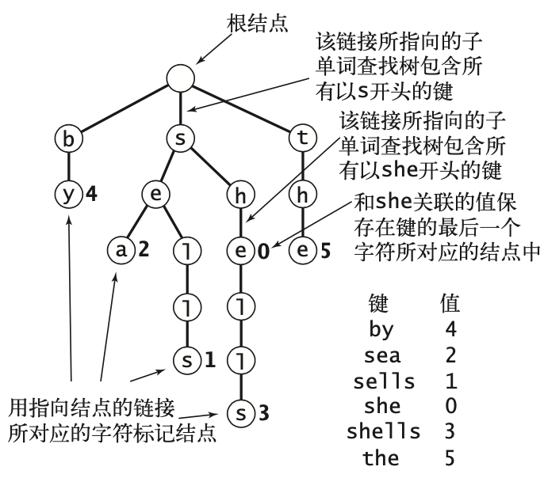
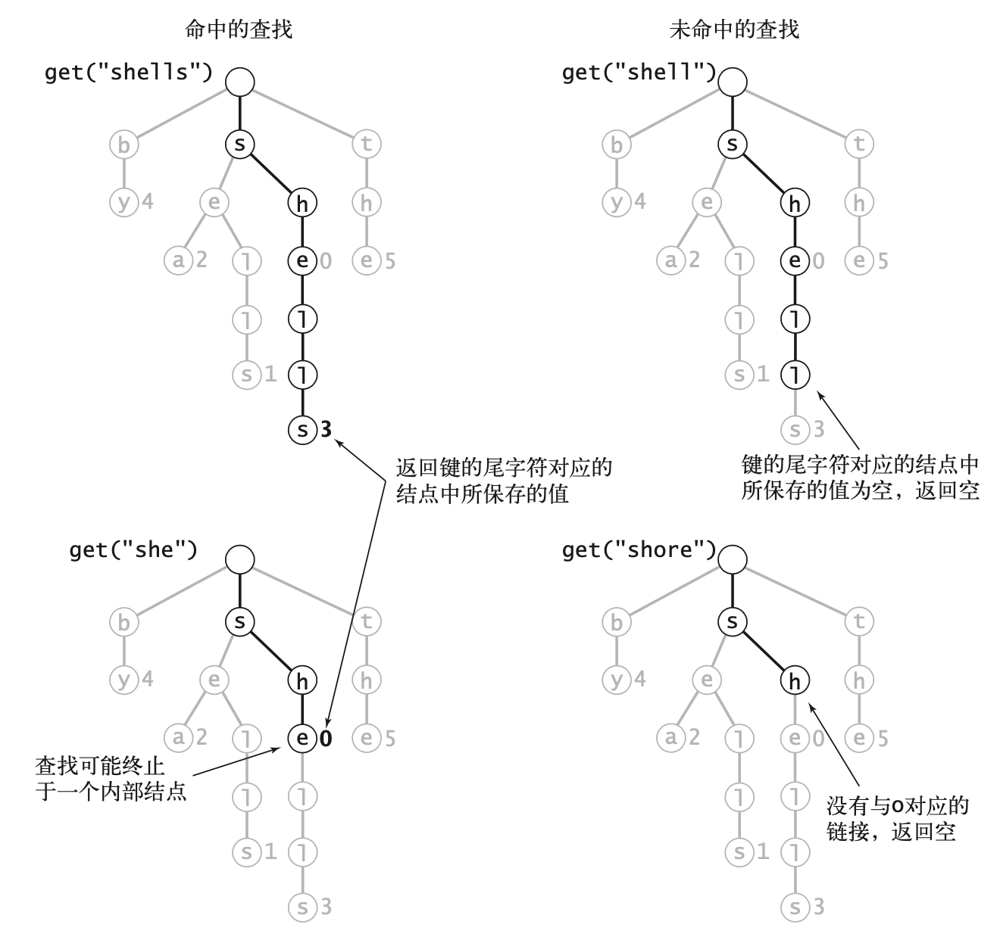
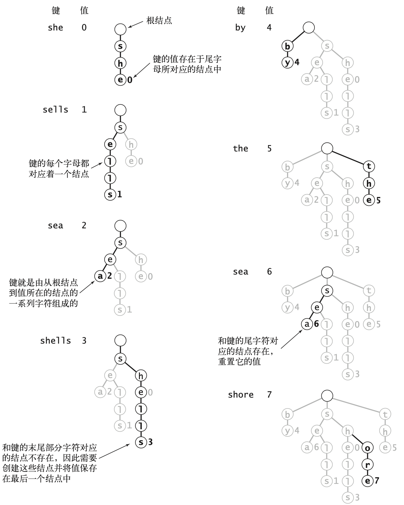
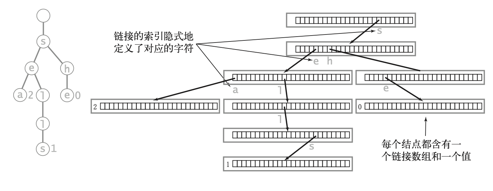
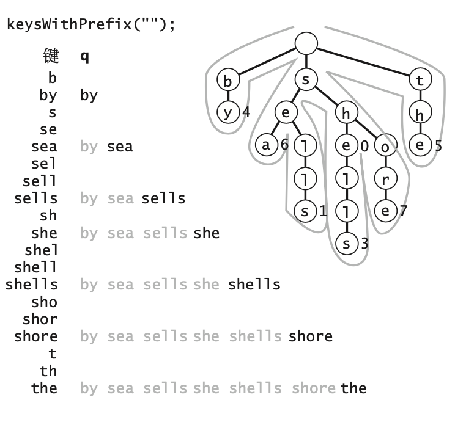
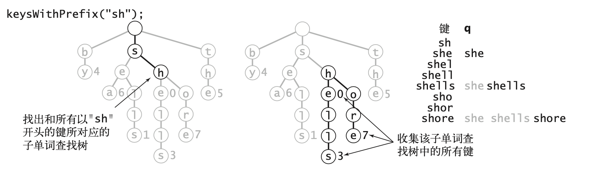
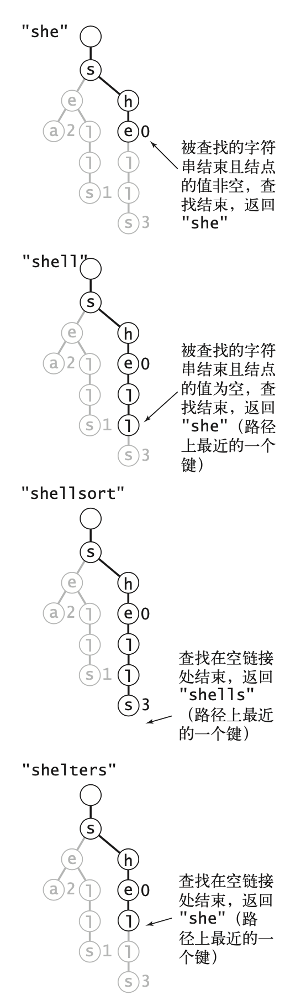
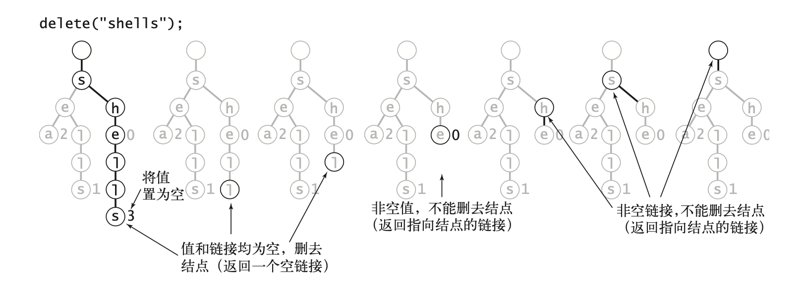

# 单词查找树

## 1. 基本性质

## 2. 单词查找树中的查找操作

## 3. 单词查找树中的插入操作

## 4. 结点的表示

将空链接考虑进来，突出单词查找树的下面两个重要性质

* 每个结点都含有R个链接，对应着可能出现的字符。
* 字符和键值隐式地保存在数据结构中。

## 5. 大小 size()

和二叉查找树一样，size()方法的实现由一下3种方式实现。

* 即时实现：一个变量N保存键的数量。
* 更加即时实现：用结点是列变量保存子单词查找树中键的数量，在递归的put() 和 delete() 方法调用之后更新它们。
* 延时递归实现，递归查找，很有指导意义，但是实现应经可能避免，因为会造成性能上的损耗。

## 6. 查找所有键

收集一棵单词查找树中的所有键的轨迹

单词查找树中的前缀匹配

## 7. 通配符匹配

keysThatMatch()，需要为collet添加一个参数指定匹配模式。

* 如果模式中含有通配，递归调用处理所有的链接，否则只需处理模式中指定的字符的链接即可。
* 不应该超过模式字符串的键。

## 8. 最长前缀

## 9. 删除操作

 

## 10. 字母表

字母表26个小写字母，加上大写字母26个，共52个

