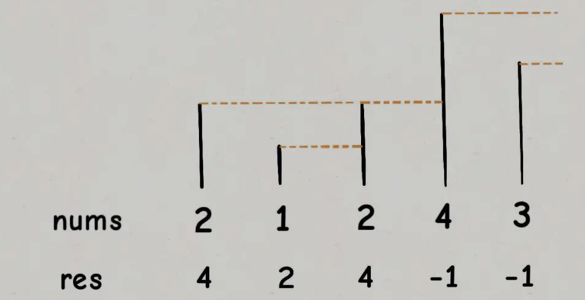

# 单调栈

| 题号 | 题目             |      |
| ---- | ---------------- | ---- |
| 496  | 下一个更大元素   | *    |
| 503  | 下一个更大元素II | **   |
|      |                  | **   |

1	42. 接雨水（困难）	暴力解法、优化、双指针、单调栈
2	739. 每日温度（中等）	暴力解法 + 单调栈
3	496. 下一个更大元素 I（简单）	暴力解法、单调栈
4	316. 去除重复字母（困难）	栈 + 哨兵技巧（Java、C++、Python）
5	901. 股票价格跨度（中等）	「力扣」第 901 题：股票价格跨度（单调栈）
6	402. 移掉K位数字
7	581. 最短无序连续子数组


作者：liweiwei1419
链接：https://leetcode.cn/problems/largest-rectangle-in-histogram/solution/bao-li-jie-fa-zhan-by-liweiwei1419/
来源：力扣（LeetCode）
著作权归作者所有。商业转载请联系作者获得授权，非商业转载请注明出处。



单调队列解决问题的模版

```c++
vector<int> nextGreaterElement (vector<int>& nums) {
    vector<int> res(nums.size());
    stack<int> s;
    //倒着往栈里放
    for (int i = nums.size()-1; i>= 0; i--) {
        //判定个子高矮
        while (!s.empty() && s.top() <= nums[i]) {
            //矮个儿退出栈，反正被挡住了
            s.pop();
        }
        // nums[i] 身后的next greater number
        res[i] = e.empty()?-1:e.top();
        s.push(nums[i]);
    }
    return num;
}
```

给你一个数组`T`，这个数组存放的是近几天的天气气温，你返回一个等长的数组，计算：**对于每一天，你还要至少等多少天才能等到一个更暖和的气温；如果等不到那一天，填 0**。

函数签名如下：

```
vector<int> dailyTemperatures(vector<int>& T);
```

比如说给你输入`T = [73,74,75,71,69,76]`，你返回`[1,1,3,2,1,0]`。

```c++
vector<int> dailyTemperatures(vector<int> & T) {
    vector<int> res(T.size());
    //这里存放元素的索引，而不是元素
    stack<int> s;
    //单调栈模版
    for (int i = T.length()-1; i>=0; i++) {
        while (!s.isEmpty() && T[s.top()] <= T[i]) {
            s.pop();
        }
        //得到索引间距
        res[i] = s.isEmpty() ? 0 : (s.top()-i);
        //将索引入栈
        s.push(i);
    }
    return res;
}
```