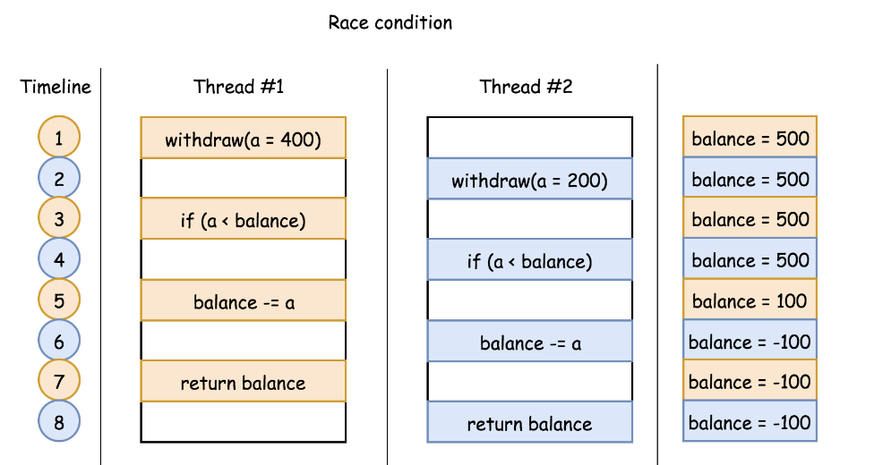
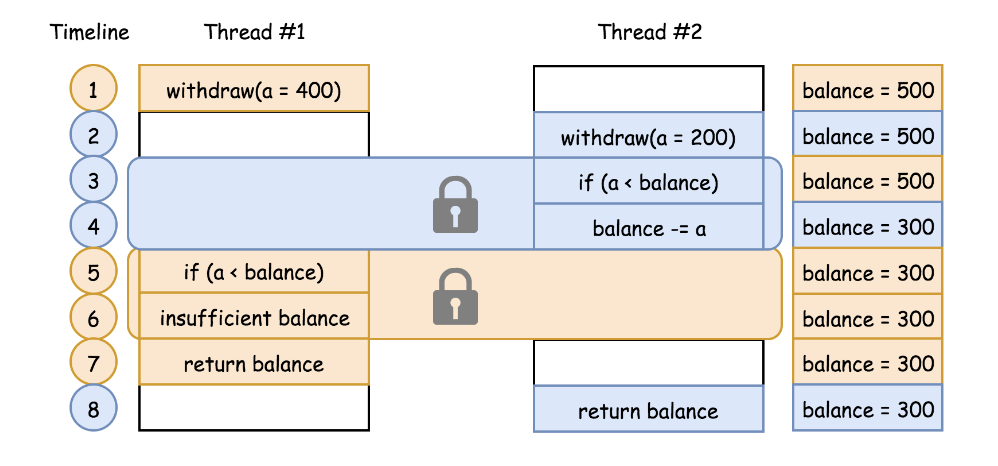
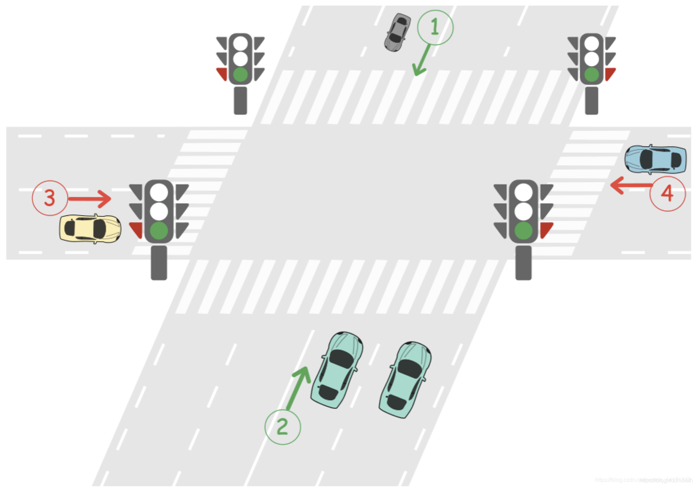
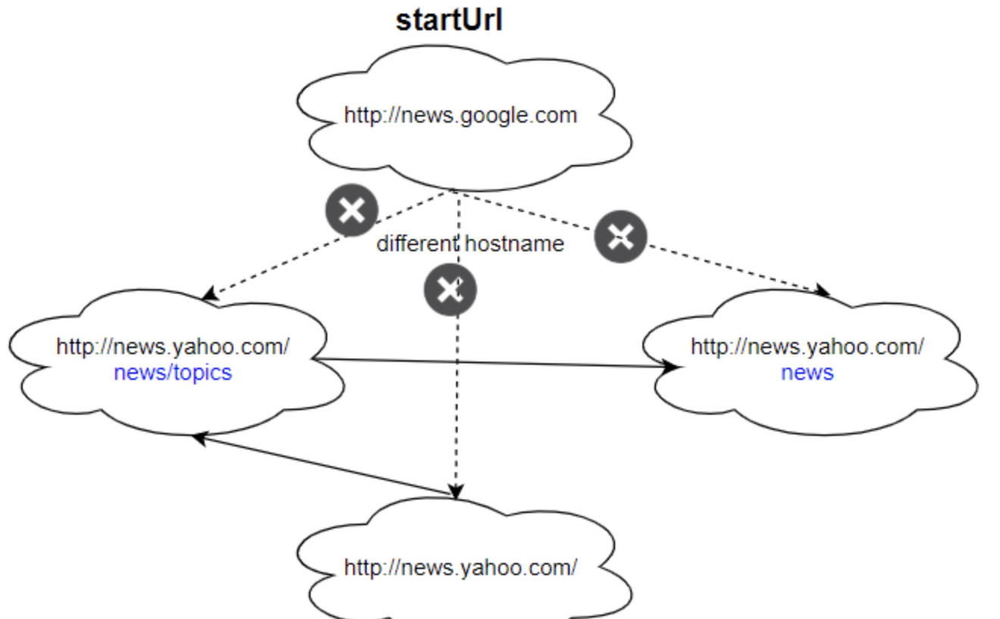
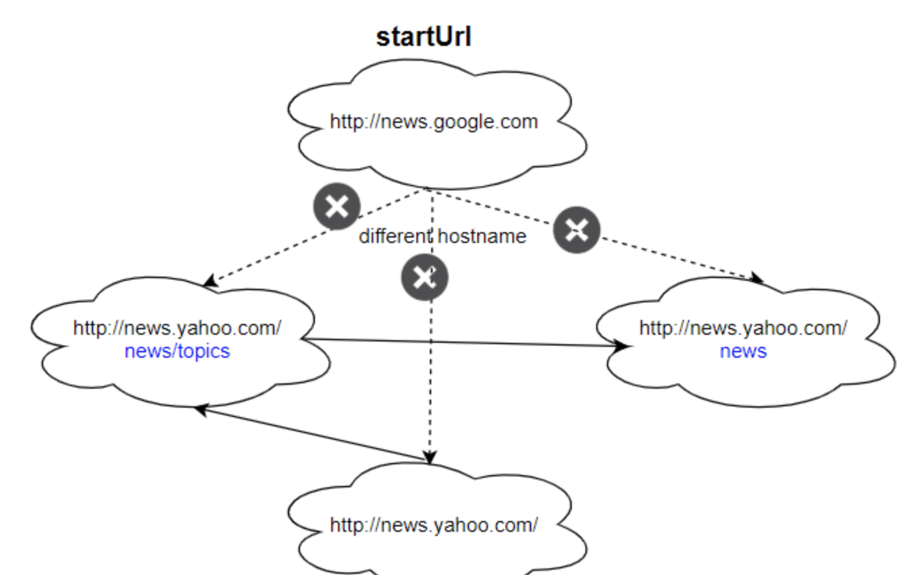

# 并发问题 
并发问题来自并发计算的场景，该场景下，程序在多线程（或多进程）中 同时 执行。

同时进行并不是完全指进程或线程在不同的物理 CPU 上独立运行，更多情况下，是在一个物理 CPU 上交替执行多个线程或进程。并发既可在线程中，也可在进程中。

并发主要为多任务情况设计。但如果应用不当，可能会引发一些漏洞。按照情况不同，可以分为三种：

竞态条件：由于多进程之间的竞争执行，导致程序未按照期望的顺序输出。

死锁：并发程序等待一些必要资源，导致没有程序可以执行。

资源不足：进程被永久剥夺了运行所需的资源。

此题中存在竞态条件。下面展示一个竞态条件的例子。

假设有一个方法 withdraw(amount)，如果请求量小于当前余额，则从当前余额中减去请求量，然后返回余额。方法定义如下：

```java
int balance=500;
int withdraw(int amount){
    if(amount<balance){
        balance-=amount;
    }
    return balance;
}
```

我们 期望 该方法执行后余额永远不会为负。

但是有可能出现竞态条件，使得余额变为负数。假设两个线程同时使用不同的参数执行该方法。例如：线程 1 执行 withdraw(amount=400)，线程 2 执行 withdraw(amount=200)
。这两个线程的执行顺序如下图所示。在每个时刻只执行一条语句。



上述流程执行结束后，余额变成负数，这并不是期望的输出。

无竞争并发 并发问题有一个共同特征：多个线程/进程之间共享一些资源（例如：余额）。由于无法消除资源共享的约束，防止并发问题就变成了 资源共享的协调 问题。

根据这个思路，如果可以确保程序中 关键部分代码的独占性（例如：检查和减少余额），就可以防止程序进入不一致的状态。

竞争条件的解决方案为：需要某些关键部分代码具有排他性，即在给定的时间内，只有一个线程可以进入关键部分代码。

可以将这种机制看做限制关键部分代码访问的锁。在前面示例的关键部分代码加锁，即检查余额和减少余额的语句。然后重新运行两个线程，会有下图的执行顺序：



在该机制下，一旦一个线程进入关键部分，它就可以阻止其他线程进入该关键部分。例如，在时间点 3，线程 2 进入关键部分，那么在时间点 4，如果没有锁保护，线程 1 就可能进入关键部分。最后两个线程同时运行，保证系统的一致性，并确保余额正确。

如果该线程未被授权进入关键代码，可以认为该线程被阻塞或进入睡眠状态。例如，线程 1 在时间点 4 被阻塞，之后关键部分被释放，可以通知其他等待线程。线程 2 在时间点 5 释放了关键部分，就可以通知 线程 1 进入。

这种机制还具有唤醒其他等待线程的功能。

总之，为了防止出现并发竞争状态，需要一种具有两种功能的机制：1）关键部分的访问控制；2）通知阻塞线程


# 例题
## 1279 红绿灯路口

这是两条路的交叉路口。第一条路是A路，车辆可沿1号方向由北向南行驶，也可沿2号方向由南向北行驶。第二条路是B路，车辆可
沿3号方向由西向东行驶，也可沿4号方向由东向西行驶。



每条路在路口前都有一个红绿灯。红绿灯可以亮起红灯或绿灯。

绿灯表示两个方向的车辆都可通过路口。
红灯表示两个方向的车辆都不可以通过路口，必须等待绿灯亮起。
两条路上的红绿灯不可以同时为绿灯。这意味着，当 A 路上的绿灯亮起时，B 路上的红灯会亮起；当 B 路上的绿灯亮起时，A 路上的红灯会亮起.


开始时，A 路上的绿灯亮起，B 路上的红灯亮起。当一条路上的绿灯亮起时，所有车辆都可以从任意两个方向通过路口，直到另一条路上的绿灯亮起。不同路上的车辆不可以同时通过路口。

给这个路口设计一个没有死锁的红绿灯控制系统。

实现函数 void carArrived(carId, roadId, direction, turnGreen, crossCar) :

carId 为到达车辆的编号。
roadId 为车辆所在道路的编号。
direction 为车辆的行进方向。
turnGreen 是一个函数，调用此函数会使当前道路上的绿灯亮起。
crossCar 是一个函数，调用此函数会允许车辆通过路口。
当你的答案避免了车辆在路口出现死锁，此答案会被认定为正确的。当路口已经亮起绿灯时仍打开绿灯，此答案会被认定为错误的。

示例 1:
```
输入: cars = [1,3,5,2,4], directions = [2,1,2,4,3], arrivalTimes = [10,20,30,40,50]
输出: [
“Car 1 Has Passed Road A In Direction 2”, // A 路上的红绿灯为绿色，1 号车可通过路口。
“Car 3 Has Passed Road A In Direction 1”, // 红绿灯仍为绿色，3 号车通过路口。
“Car 5 Has Passed Road A In Direction 2”, // 红绿灯仍为绿色，5 号车通过路口。
“Traffic Light On Road B Is Green”, // 2 号车在 B 路请求绿灯。
“Car 2 Has Passed Road B In Direction 4”, // B 路上的绿灯现已亮起，2 号车通过路口。
“Car 4 Has Passed Road B In Direction 3” // 红绿灯仍为绿色，4 号车通过路口。
]
```

示例 2:
```
输入: cars = [1,2,3,4,5], directions = [2,4,3,3,1], arrivalTimes = [10,20,30,40,40]
输出: [
“Car 1 Has Passed Road A In Direction 2”, // A 路上的红绿灯为绿色，1 号车可通过路口。
“Traffic Light On Road B Is Green”, // 2 号车在 B 路请求绿灯。
“Car 2 Has Passed Road B In Direction 4”, // B 路上的绿灯现已亮起，2 号车通过路口。
“Car 3 Has Passed Road B In Direction 3”, // B 路上的绿灯现已亮起，3 号车通过路口。
“Traffic Light On Road A Is Green”, // 5 号车在 A 路请求绿灯。
“Car 5 Has Passed Road A In Direction 1”, // A 路上的绿灯现已亮起，5 号车通过路口。
“Traffic Light On Road B Is Green”, // 4 号车在 B 路请求绿灯。4 号车在路口等灯，直到 5 号车通过路口，B 路的绿灯亮起。
“Car 4 Has Passed Road B In Direction 3” // B 路上的绿灯现已亮起，4 号车通过路口。
]
解释: 这是一个无死锁的方案。注意，在 A 路上的绿灯亮起、5 号车通过前让 4 号车通过，也是一个正确且可被接受的方案。
```


提示：
```
1 <= cars.length <= 20
cars.length = directions.length
cars.length = arrivalTimes.length
cars 中的所有值都是唯一的。
1 <= directions[i] <= 4
arrivalTimes 是非递减的。
```

## 1242. 多线程网页爬虫
给你一个初始地址 startUrl 和一个 HTML 解析器接口 HtmlParser，请你实现一个 多线程的网页爬虫，用于获取与 startUrl 有 相同主机名 的所有链接。

以 任意 顺序返回爬虫获取的路径。

爬虫应该遵循：

从 startUrl 开始
调用 HtmlParser.getUrls(url) 从指定网页路径获得的所有路径。
不要抓取相同的链接两次。
仅浏览与 startUrl 相同主机名 的链接。


如上图所示，主机名是 example.org 。简单起见，你可以假设所有链接都采用 http 协议，并且没有指定 端口号。举个例子，链接 http://leetcode.com/problems 和链接 http://leetcode.com/contest 属于同一个 主机名， 而 http://example.org/test 与 http://example.com/abc 并不属于同一个 主机名。

HtmlParser 的接口定义如下：

```java
interface HtmlParser{
    // Return a list of all urls from a webpage of given url.
// This is a blocking call, that means it will do HTTP request and return when this request is finished.
    public List<String> getUrls(String url);
}
```
注意一点，getUrls(String url) 模拟执行一个HTTP的请求。 你可以将它当做一个阻塞式的方法，直到请求结束。 getUrls(String url) 保证会在 15ms 内返回所有的路径。 单线程的方案会超过时间限制，你能用多线程方案做的更好吗？

对于问题所需的功能，下面提供了两个例子。为了方便自定义测试，你可以声明三个变量 urls，edges 和 startUrl。但要注意你只能在代码中访问 startUrl，并不能直接访问 urls 和 edges。

拓展问题：

假设我们要要抓取 10000 个节点和 10 亿个路径。并且在每个节点部署相同的的软件。软件可以发现所有的节点。我们必须尽可能减少机器之间的通讯，并确保每个节点负载均衡。你将如何设计这个网页爬虫？
如果有一个节点发生故障不工作该怎么办？
如何确认爬虫任务已经完成？

示例 1：



```
输入：
urls = [
"http://news.yahoo.com",
"http://news.yahoo.com/news",
"http://news.yahoo.com/news/topics/",
"http://news.google.com",
"http://news.yahoo.com/us"
]
edges = [[2,0],[2,1],[3,2],[3,1],[0,4]]
startUrl = "http://news.yahoo.com/news/topics/"
输出：[
"http://news.yahoo.com",
"http://news.yahoo.com/news",
"http://news.yahoo.com/news/topics/",
"http://news.yahoo.com/us"
]
```

示例 2：



```
输入：
urls = [
"http://news.yahoo.com",
"http://news.yahoo.com/news",
"http://news.yahoo.com/news/topics/",
"http://news.google.com"
]
edges = [[0,2],[2,1],[3,2],[3,1],[3,0]]
startUrl = "http://news.google.com"
输出：["http://news.google.com"]
解释：startUrl 链接与其他页面不共享一个主机名。
```


提示：
```
1 <= urls.length <= 1000
1 <= urls[i].length <= 300
startUrl 是 urls 中的一个。
主机名的长度必须为 1 到 63 个字符（包括点 . 在内），只能包含从 “a” 到 “z” 的 ASCII 字母和 “0” 到 “9” 的数字，以及中划线 “-”。
主机名开头和结尾不能是中划线 “-”。
参考资料：https://en.wikipedia.org/wiki/Hostname#Restrictions_on_valid_hostnames
你可以假设路径都是不重复的。
```
