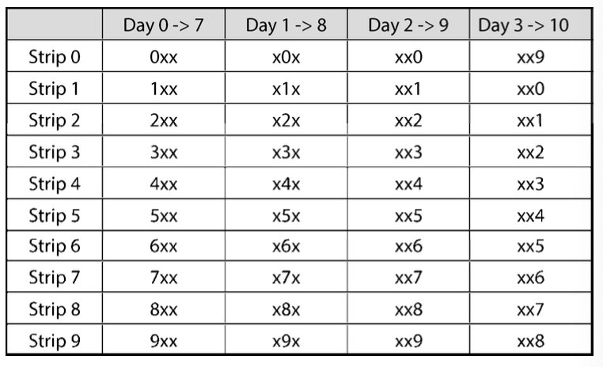

## 6.1 较重的药丸。

有20瓶药丸，其中19瓶装有1.0克的药丸，余下1瓶装有1.1克的药丸。给你一台称重精准的天平，怎么找出比较重的那瓶药丸?天平只能用一次。

**思路**：

题目要求天平只能用一次，因此肯定是一次称多个药丸。

假设有两个药丸，第一个药瓶取1个药丸，第二个取1个药丸，那么如果重量是2.1g 那我们无法辨别哪一瓶是较重的。但是若是第一个药瓶取1个，第二个药瓶取2个，那么重量如果是 3.2g ，那么可以断定第二个药瓶是里的药是较重的。这个就是这道题的诀窍。

称一堆药丸时，我们会有一个预期重量，借助预期重量和实测重量之间的差值，就能得到那一瓶药比较重。

从药瓶 #1 取1粒，#2中取2粒...#20 中取20粒，那么预期 1 + 2 + 3 + ... + 20 = (1 + 20) *20/2 = 210。实际称多出来的肯定是较重的那一瓶的重量。药瓶编号即为 $\frac{weigth - 210}{0.1}$ ，假设实际称的 211.3g，则药瓶 #13 装有较重的药丸。

## 6.2 篮球问题。

有个篮球框，下面两种玩法可任选一种。
 玩法 1:一次出手机会，投篮命中得分。
 玩法 2:三次出手机会，必须投中两次
 如果 p 是某次投篮命中的概率，则 p 的值为多少时才会选择玩法 1 或玩法 2?

**思路**：

要解此题，可以采用概率论，比较赢得各种玩法的概率，

1. 赢得玩法1的概率

   根据定义，玩法1 赢得的概率为 p。

2. 赢得玩法2的概率

   另 $s(k,n)$为投递n此准确投中的概率，赢得玩法2的概率是三投两中，或者三投三中的概率。

   即，$P(获胜) = s(2,3) + s(3,3)$

   三投三中的概率为 $p^3$

   三投两中的概率为：
   $$
   \begin{align*}
   & P(第1、2次中，第3次未投中) + P(第1、3次中，第2次没投中) + P(第2、3次中，第1次未中) \\
   & = p \times p \times (1-p) + p \times (1-p) \times p + (1-p) \times p \times p \\
   & =3(1-p)p^2 \\
   \end{align*}
   $$
   即 P(获胜)的概率如下
   $$
   \begin{align*}  
   & p^3 + 3(1-p)p^2  \\
   &=3P^2 -2p^3
   \end{align*}
   $$

3. 选择哪种玩法

   若 P(玩法1) > P(玩法2)，则应该选择玩法1
   $$
   \begin{align}
   & p > 3p^2 - 2p^3	\\
   & 1 > 3p-2p^2 		\\ 
   & 2p^2 -3p +1 >0 	\\
   &(2p-1)(p-1) > 0	\\
   \end{align}
   $$
   由于 $p<1$ 所以 $p-1< 0$,因此 $2p-1<0$

   因此：
   $$
   2p-1<0\\
   p<0.5
   $$
   综上所述，$0<p<0.5$ 则应该选择玩法1。若 $0.5<p<1$ 则应该选择 玩法2，若 $p=0.5$ 则两种玩法概率相等。

## 6.3 多米诺骨牌。

有个8×8棋盘，其中对角的角落上，两个方格被切掉了。给定31块多 米诺骨牌，一块骨牌恰好可以覆盖两个方格。用这 31 块骨牌能否盖住整个棋盘?请证明你的答 案(提供范例或证明为什么不能)。

## 6.4 三角形上的蚂蚁。

三角形的三个顶点上各有一只蚂蚁。如果蚂蚁开始沿着三角形的 边爬行，两只或三只蚂蚁撞在一起的概率有多大?假定每只蚂蚁会随机选一个方向，每个方向 被选到的概率相等，而且三只蚂蚁的爬行速度相同。

**类似问题**：在 n 个顶点的多边形上有 n 只蚂蚁，求出这些蚂蚁发生碰撞的概率。

## 6.5 水壶问题

有两个水壶，容量分别为3夸脱和5夸脱，若水的供应不限量(但没有 量杯)，怎么用这两个水壶得到刚好的水?注意，这两个水壶呈不规则状，无法精准地装满“半壶”水。

## 6.6 蓝眸岛。

有个岛上住着一群人，有一天来了个游客，定了一条奇怪的规矩:所有蓝眼 睛的人都必须尽快离开这个岛。每晚 8 点会有一个航班离岛。每个人都看得见别人眼睛的颜色， 但不知道自己的(别人也不可以告知)。此外，他们不知道岛上到底有多少人有蓝眼睛，只知道 至少有一个人的眼睛是蓝色的。所有蓝眼睛的人要花几天才能离开这个岛?

## 6.7 大灾难。

在大灾难后的新世界，世界女王非常关心出生率。因此，她规定所有家庭 都必须有一个女孩，否则将面临巨额罚款。如果所有的家庭都遵守这个政策——所有家庭在得 到一个女孩之前不断生育，生了女孩之后立即停止生育——那么新一代的性别比例是多少(假 设每次怀孕后生男生女的概率是相等的)?通过逻辑推理解决这个问题，然后使用计算机进 行模拟。

## 6.8 扔鸡蛋问题。

有栋建筑物高100层，若从第N层或更高的楼层扔下来，鸡蛋就会破 碎;若从第 N 层以下的楼层扔下来则不会破碎。给你两个鸡蛋，请找出 N，并要求最差情况下 扔鸡蛋的次数为最少。

## 6.9 100个储物柜。

走廊上有100个关上的储物柜。有个人先是将100个柜子全都打开。 接着，每数两个柜子关上一个。然后，在第三轮时，再每隔两个就切换第三个柜子的开关状态 (也就是将关上的柜子打开，将打开的关上)。照此规律反复操作 100 次，在第 i 轮，这个人会每数 i 个就切换第 i 个柜子的状态。当第 100 轮经过走廊时，只切换第 100 个柜子的开关状态，此时有几个柜子是开着的?

## 6.10 有毒的苏打水。

你有1000瓶苏打水，其中有一瓶有毒。你有10条可用于检测毒物的试纸。一滴毒药会使试纸永久变黄。你可以一次性地将任意数量的液滴置于试纸上，你也可以多次重复使用试纸(只要结果是阴性的即可)。 但是，每天只能进行一次测试，用时 7 天才可得到测试结果。你如何用尽量少的时间找出哪瓶苏打水有毒?

进阶：编写程序模拟你的方法。

1. 简单的方案：28天

   将苏打水分成10份给每条试纸。等待7天后，得到一份阳性的试纸，可以断定有毒苏打水在其对应的100瓶苏打水中。对着100瓶不断重复此过程，直到测试对象有 1 瓶苏打水。

   （1）将所有的苏打水平均分配给所有可用的试纸。在一组之内，取每瓶的一滴放在试纸上。

   （2）7天后，检查试纸的结果。

   （3）对于测试结果呈阳性的试纸，选择该试纸对应的苏打水。如果该组的苏打水瓶水为1，即找到了有毒的苏打水。如果该组的苏打水瓶数多于1，则回到（1）。

2. 优化方案：10天

   

   ​		将苏打水分成10组（第0～99瓶对应试纸 0，第100～199对应试纸1，第200～299 对应试纸2，依次类推），那么第 7 天的结果将可以显示那瓶有毒的苏打水编号的第一位是什么。如果第7天第i号试纸呈现阳性结果，那么有毒的苏打水编号的第一位数字（百位数字）必然为i。

   ​		通过另外的方法进行分组，可以测试出有毒苏打水编号的第二位和第三位数字。只需要在不同的日子进行测试，以便于可以分清是哪一位的数字。

   ​		如：第7天4号试纸出现阳性，第8天3号试纸出现阳性，第9天8号试纸出现阳性，则可以得到苏打水编号为 #438。

   ​		考虑特殊情况，有毒苏打水编号的某位数字出现了重复怎么办？例如，编号 #882 或 # 438。

   ​		这两个例子不同：

   ​		如果第8天没有新的试纸呈现阳性的结果，那么可以确定第二个数字和第一个数字相等。

   ​		如果第9天没有新的试纸出现阳性试纸。该如何判断？第三位数字与第一位或第二位数字相等，但并不知道标号是 #383 还是 #388。这两个结果有着相同的测试结果。

   ​		因此，我们需要再进行一组测试。可以在最后进行该组测试，以消除不确定性。也可以再第3天进行测试。我们仅需做的是，将最后数字对应的试纸进行一次平移，以便获得第2天不同的测试结果。

   ​		至此，（1）如果有毒的苏打水编号为 #383，则得到的结果是：第7天位3号试纸，第8天位8号试纸，第9天没有新的试纸显示，第10天4号试纸。（2）如果有毒的苏打水编号为 #388 ，则得到的结果是：第7天为第3号试纸，第8天是8号试纸，第9天没有新的试纸显示，第10天为第9号试纸。我们可以通过将第 10 天得到的结果“向反方向平移”，以便区分这两瓶苏打水中有哪一瓶有毒。

   ​		另外还有一个问题，第10天还是没有新的试纸显示，该怎么办，可能出现这种情况吗？答案是有可能的。如果有毒的苏打水为 #898 则得到的结果是：第7天为8号试纸，第8天为8号试纸，第9天没有新试纸出现，第10天也没有新试纸出现。但这无关要紧，我们要能区分 #898 和 #899 的苏打水即可。如果有毒的苏打水为 #899，则得到的结果是：第7天为8号试纸，第8天为9号试纸，第9天没有新试纸，第10天为0号试纸 。

3. 最优方案：7天

   ​		每条试纸都是有含义的，其可以作为一个二进制位用于表示有毒或无毒。是否可能将100个键映射到 10个二进制位上，使得对于每一个键，都有一个唯一确定的二进制表示呢？这正是二进制数的表示方法。

   ​		我们可以将每一瓶苏打水的编号用二进制数表示。如果某一编号的第i位为1，那么就去该编号对应的苏打水滴在滴 i 条试纸上。请注意，$2^{10}$ d的值为 1024，所以10条试纸足以满足 1024 瓶苏打水的测试需求。

   ​		我们等待7天后获取结果。如果第 i 条试纸显示为阳性，那么将结果的第 i 位设置为 1。读取所有试纸的测试结果后，可以得到有毒的苏打水的编号。

