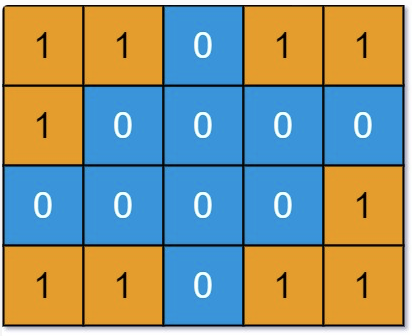

[TOC]

# 一、回溯

# 二、BFS

# 三、DFS

## 1. 岛屿问题

### 力扣第 694 题「 [不同的岛屿数量](https://leetcode.cn/problems/number-of-distinct-islands/)」

题目还是输入一个二维矩阵，`0` 表示海水，`1` 表示陆地，这次让你计算 **不同的 (distinct)** 岛屿数量，函数签名如下：

```java
int numDistinctIslands(int[][] grid)
```



其中有四个岛屿，但是左下角和右上角的岛屿形状相同，所以不同的岛屿共有三个，算法返回 3

## 2. 解数独