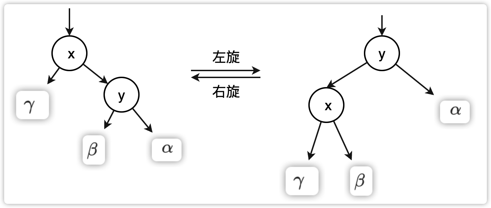

# 红黑树

## 性质

1. 每个节点是红色的，或者黑色的。
2. 根节点是黑色的
3. 每个叶结点（NIL）是黑色的
4. 如果一个结点是红色的，则它的两个孩子都是黑色的
5. 对于每一个结点，从该结点到所有后代叶子节结点的简单路径上，均包含相同数目的黑色结点。

从某个结点 $x$ （不含该结点）出发到达叶结点的路径上黑色结点的个数称为该结点的**黑高（black-height）**，记为 $bh(x)$，根据性质5，从该结点出发到叶结点简单路径的黑色结点的个数相同。于是定义**红黑树的黑高为其根结点的黑高**。

一颗有$n$ 个内部节点的红黑树的高度至多为 $2\lg(n+1)$

证明，设 $h$ 为树的高度，根据性质4，从根到页结点（不包括根结点）的任何一条简单路径上都至少有一半的颜色是黑色，因此，根的黑高至少为$ h/2$ ,于是
$$
n \geqslant 2^{h/2} -1
$$
 把1已到左侧，在两边取对数，得到 $h \leqslant 2lg(n+1)$

