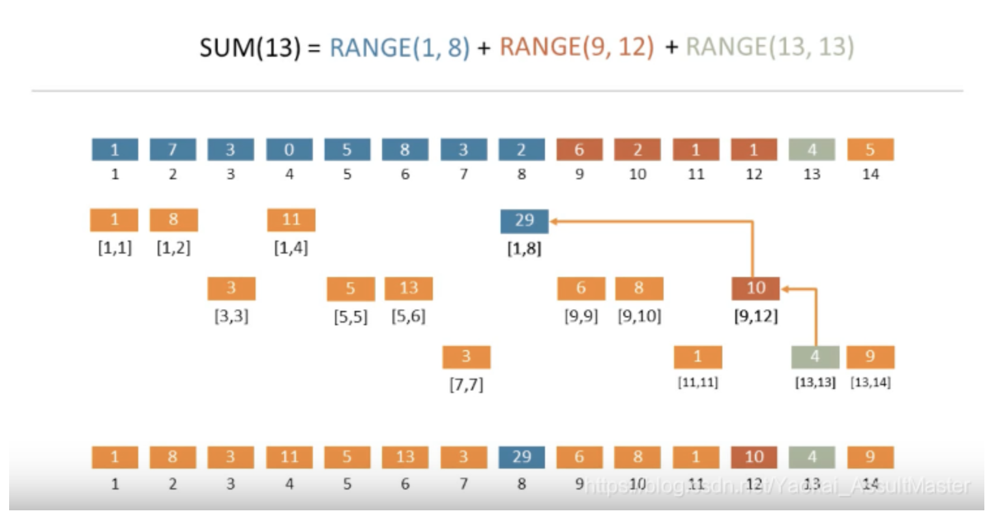
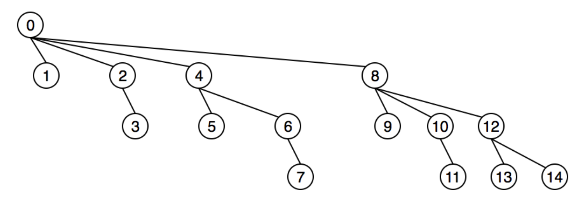
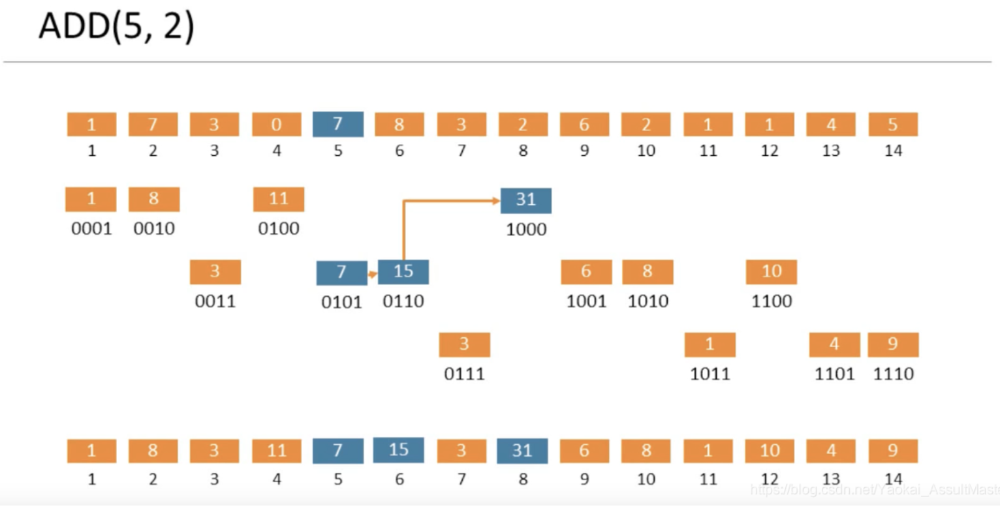

# 线段树

# 树状数组（Binary Indexed Tree），看这一篇就够了定义

根据[维基百科](https://en.wikipedia.org/wiki/Fenwick_tree)的定义：

> A **Fenwick tree** or **binary indexed tree** is a data structure that can efficiently update elements and calculate [prefix sums](https://en.wikipedia.org/wiki/Prefix_sum) in a table of numbers.

也就是说，所谓[树状数组](https://so.csdn.net/so/search?q=树状数组&spm=1001.2101.3001.7020)，或称Binary Indexed Tree, Fenwick Tree，是一种用于高效处理对一个存储数字的列表进行更新及求前缀和的数据结构。

举例来说，树状数组所能解决的典型问题就是存在一个长度为`n`的数组，我们如何高效进行如下操作：

1. `update(idx, delta)`：将`num`加到位置`idx`的数字上。
2. `prefixSum(idx)`：求从数组第一个位置到第`idx`（含`idx`）个位置所有数字的和。
3. `rangeSum(from_idx, to_idx)`：求从数组第`from_idx`个位置到第`to_idx`个位置的所有数字的和

对于上述问题，除去每次求和都对原数组相关数字暴力相加求和的解法外，另一种较简单解法为使用`O(n)`时间构造一个_前缀和数组（cumulative sum）_，即该数组中的第`i`个位置保存原数组中前`i`个元素的和，则对于上述每一个操作，我们有：

1. `update(idx, delta)`：更新操作需要更新cumulative sum数组中每一个受此更新影响的前缀和，即从`idx`其到最后一个位置的前缀和。该操作为`O(n)`时间复杂度。
2. `prefixSum(idx)`：直接返回`cumulativeSum[idx + 1]`即可。该操作为`O(1)`时间复杂度。
3. `rangeSum(from_idx, to_idx)`：直接返回`cumulativeSum[to_idx + 1] - cumulativeSum[from_idx]`即可。该操作为`O(1)`操作。

可以看出，该简单解法的求和操作非常高效，而单个更新操作为线性时间。如果所需的更新操作的数量远少于求和操作的话，该解法非常合适。反之，如果更新操作较多，我们就需要思考优化的方法。

那么使用树状数组解决该问题的目的就是为了在保证求和操作依然高效的前提下优化`update(idx, delta)` 操作的时间复杂度。

# 填坑法构造Binary Indexed Tree

所谓的Binary Indexed Tree，首先需要明确它其实并不是一棵树。Binary Indexed Tree事实上是将根据数字的二进制表示来对数组中的元素进行逻辑上的分层存储。

Binary Indexed Tree求和的基本思想在于，给定需要求和的位置`i`，例如13，我们可以利用其二进制表示法来进行分段（或者说分层）求和：`13 = 2^3 + 2^2 + 2^0`，则`prefixSum(13) = RANGE(1, 8) + RANGE(9, 12) + RANGE(13, 13)` （注意此处的`RANGE(x, y)`表示数组中第`x`个位置到第`y`个位置的所有数字求和）。如下面例子中所示：

```
arr = [1, 7, 3, 0, 5, 8, 3, 2, 6, 2, 1, 1, 4, 5]
prefixSum(13) = RANGE(1, 8) + RANGE(9, 12) + RANGE(13, 13)
= 29 + 10 + 4 = 43
123
```

那么如果我们将上述的range sum提前计算好的话，`prefixSum(13)`可以直接由它们相加得到。那么我们所需要解决的问题就是，根据何种规则来计算和存储这样的二进制表示后所需的range sum呢？规则如下图中所示。


图中第一行为原数组，第二到第四行为依次按层填坑的过程。我们需要从左到右，从上到下依次将相应的值填入对应的位置中。最后一行中即为最终所形成的树状数组。

以图中第二行，也就是构造树状数组第一层的过程为例，我们首先需要填充的是数组中第一个数字开始，长度为__2的指数__个数字的区间内的数字的累加和。所以图中分别填充了从第一个数字开始，长度为`2^0, 2^1, 2^2, 2^3`的区间的区间和。到此为止这一步就结束了。因为`2^4`超过了我们原数组的长度范围。

下一步我们构造数组的第二层。与上一层类似，我们依然填充余下的空白中从第空白处一个位置算起长度为__2的指数__的区间的区间和。例如`3-3`空白，我们只需填充从位置3开始，长度为1的区间的和。再如`9-14`空白，我们需要填充从9开始，长度为`2^0`（9-9），`2^1`（9-10），`2^2`（9-12）的区间和。

类似地，第三层我们填充`7-7`，`11-11`和`13-14`区间的空白。

到此为止，我们已经完全的构造了对应于输入数组的一个树状数组。将该数组即为`BIT`（方便起见，此处对此数组的索引为从1开始）.

利用图中已构造好的树状数组，则：

```
prefixSum(13) = prefixSum(0b00001101)
= BIT[13] + BIT[12] + BIT[8]
= BIT[0b00001101] + BIT[0b00001100] + BIT[0b00001000]
123
```

如下图所示。这样一来，我们也就解决了上面提出的如何记录range sum以方便求和的问题。



# 利用Binary Indexed Tree求prefix sum或range sum

通过上面的例子我们得知求前缀和的过程事实上是在树状数组所代表的抽象的树形结构中不断移动寻找上一层母结点并求和的过程。上面例子中树状数组所表示的树如下图所示：



那么我们应该如何用代码实现这一向上寻找母结点的过程呢？

观察这个求和的过程：

```
prefixSum(13) = prefixSum(0b00001101)
= BIT[13] + BIT[12] + BIT[8]
= BIT[0b00001101] + BIT[0b00001100] + BIT[0b00001000]
123
```

可以发现，在这棵抽象的树种向上移动的过程其实就是不断将当前数字的最后一个`1`翻转为`0`的过程。基于这一事实，实现在Binary Indexed Tree中向上（在数组中向前）寻找母结点的代码就非常容易了。例如给定一个`int x = 13`，这个过程可以用如下运算实现：

```
x = 13 = 0b00001101
-x = -13 = 0b11110011
x & (-x) = 0b00000001
x - (x & (-x)) = 0b00001100
1234
```

# 更新数组中的元素

当我们调用`update(idx, delta)` 更新了原数组中的某一个数字后，显然我们也需要更新Binary Indexed Tree中相应的区间和来应对这一改变。

以`update(5, 2)`为例，我们想要给原数组中第5个位置的数字加2，基于之前构造好的Binary Indexed Tree，更新的过程如下图中所示：



从图中我们发现，从5开始，应当被更新的位置的坐标为原坐标加上原坐标二进制表示中最后一个1所代表的数字。这一过程和上面求和的过程刚好相反。以`int x = 5`为例，我们可以用如下运算实现：

```
x = 5 = 0b00000101
-x = -5 = 0b11111011
x & (-x) = 0b00000001
x + (x & (-x)) = 0b00000110
```

# Binary Indexed Tree的建立

Binary Indexed Tree的建立非常简单。我们只需初始化一个全为0的数组，并对原数组中的每一个位置对应的数字调用一次`update(i, delta)`操作即可。这是一个`O(nlogn)`的建立过程。

此外，还存在一个`O(n)`时间简历Binary Indexed Tree的算法，其步骤如下(数组下标从0开始)：

给定一个长度为`n`的输入数组`list`。

1. 初始化长度为`n + 1`的Binary Indexed Tree数组`bit`，并将`list`中的数字对应地放在`bit[1]`到`bit[n]`的各个位置。
2. 对于`1`到 `n` 的每一个 `i`，进行如下操作：
   - 令`j = i + (i & -i)`，若`j < n + 1`，则`bit[j] = bit[j] + bit[i]`

# 复杂度分析

根据上面的分析，我们可以看出，对于长度为`n`的数组，单个`update`和`prefixSum`操作最多需要访问`logn`的元素，也就是说单个`update`和`prefixSum`操作的时间复杂度均为`O(logn)`。

构建Binary Indexed Tree的时间复杂度为`O(nlogn)`或者`O(n)`，取决于我们使用哪种算法。

# 代码实现

```
public class BinaryIndexedTree {
	private int[] bitArr;
	public BinaryIndexedTree(int[] list) {
		this.bitArr = new int[list.length + 1];
		for (int i = 0; i < list.length; i++) {
			this.bitArr[i + 1] = list[i];
		}
		
		for (int i = 1; i < this.bitArr.length; i++) {
			int j = i + (i & -i);
			if (j < this.bitArr.length) {
				this.bitArr[j] += this.bitArr[i];
			}
		}
	}
	
	public void update(int idx, int delta) {
		idx += 1;
		while (idx < this.bitArr.length) {
			this.bitArr[idx] += delta;
			idx = idx + (idx & -idx);
		}
	}
	
	
	public int prefixSum(int idx) {
		idx += 1;
		int result = 0;
		while (idx > 0) {
			result += this.bitArr[idx];
			idx = idx - (idx & -idx);
		}
		
		return result;
	}
	
	
	public int rangeSum(int from_idx, int to_idx) {
		return prefixSum(to_idx) - prefixSum(from_idx - 1);
	}
}
```

# Reference

1. https://www.youtube.com/watch?v=v_wj_mOAlig