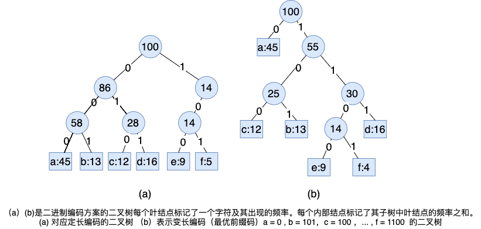

# 贪心算法

求解最优化问题算法通常需要经过一系列的步骤，在每个步骤都面临着多种选择。对于许多最优化问题，使用动态规划算法求解有些杀鸡用牛刀了，可以使用更简单、跟高效的算法。贪心算法（greedy algorithm）就是这样的算法，它在每一步都做出当时看起来最佳的选择，也就是说，它总是做出局部最优解，寄希望这样的选择能导致全局最优解。

---


# 一、活动选择问题

该例子是一个调度竞争共享资源的活动的问题，目标是**选出一个最大兼容的活动集合**。

假设活动集合$S= \{ a_1, a_2,..., a_n\}$  ，这些活动使用同一资源（例如一个阶梯教室），而这个资源在某个时刻只能供一个活动使用。每个活动 $a_i$ 都有一个开始时间 $s_i$ 和结束时间 $f_i$ ，其中 $0 \leqslant s_i < f_i< \infin$ 。如果被选中，任务 $a_i$ 发生在半开区间 $[s_i, f_i)$ 期间。如果两个活动 $a_i$ 和 $a_j$ 满足  $[s_i, f_i)$ 和  $[s_j, f_j)$ 不重叠，则称它们是兼容的。也就是说 $s_i \geqslant f_j$ 或者 $s_j \geqslant f_i$ ，则 $a_i$ 和 $a_j$ 是兼容的。在活动选择问题中，我们希望选择一个最大兼容活动集。假定活动时间已按结束时间单调递增顺序排序：
$$
f_1 \leqslant f_2 \leqslant \cdots \leqslant f_{n-1} \leqslant f_n \tag{1.1}
$$
例如，考虑如下活动集 $S$：

|   i   |  1   |  2   |  3   |  4   |  5   |  6   |  7   |  8   |  9   |  10  |  11  |
| :---: | :--: | :--: | :--: | :--: | :--: | :--: | :--: | :--: | :--: | :--: | :--: |
| $s_i$ |  1   |  3   |  0   |  5   |  3   |  5   |  6   |  8   |  8   |  2   |  12  |
| $f_i$ |  4   |  5   |  6   |  7   |  9   |  9   |  10  |  11  |  12  |  14  |  16  |

对于这个例子，子集 $\{a_i,a_9,a_11\}$ 是有相互兼容的活动组成。但它不是一个最大集，因为子集 $\{a_1，a_4,a_8,a_{11} \}$ 更大，实际上，$\{a_1，a_4,a_8,a_{11} \}$ 是一个最大兼容活动子集，另一个最大子集是$\{ a_2,a_4,a_{9},a_{11}\}$ 。

## 活动选择问题的最优子结构

$S_{i,j}$ 表示在 $a_i$ 活动结束时间之后，且在 $a_j$ 活动开始之前的活动集合。我们希望求 $S_{i,j}$ 的一个最大的相互兼容的活动子集，**=>** 假定 $A_{ij}$ 就是这样一个子集，包含活动 $a_k$ 。**=>** 由于最优解包含活动 $a_k$ ，我们得到两个子问题：寻找 $S_{ik}$ 以及 $S_{kj}$ 中的兼容活动。令 $A_{ik} = A_{ij} \cup S_{ik}$ , $A_{kj} = A_{ij} \cup S_{kj}$ ,这样 $A_{ik}$ 包含了那些在 $a_k$ 开始时间之前结束的活动，$A_{kj}$ 包含  $a_k$ 结束时间之后的开始活动。因此，$A_{ij} = A_{ik}\cup \{a_k\} \cup A_{kj} $ ，而且 $S_{ij}$ 中最大兼容任务子集 $A_{ij}$ 包含 $\left | A_{ij}  \right | = |A_{i,k}|+ |A_{k,j}| + 1$ 个活动。

> 证明：最优解 $A_{ij}$ 必然包含两个子问题  $S_{ik}$ 以及 $S_{kj}$ 的最优解。否则，如果可以找到 $S_{kj}$ 的一个兼容子集 $A_{kj}^{'}$ ,满足 $|A_{kj}^{'}| > |A_{kj}|$ ，则可以将  $A_{kj}^{'}$ 而不是 $A_{kj}$ 作为 $S_{kj}$ 的最优解的一部分。这样就构造出了一个兼容活动集，其大小为 $|A_{ik}| + |A_{kj}^{'}|  + 1 > |A_{ik}|+ |A_{kj}|+1=|A_{ij}| $ ，与 $｜A_{ij}｜$ 是最优解的假设矛盾。对于子问题 $A_{ik}$ 的问题类似可证。

如果用 $c[i,j]$ 表示结合 $S_{ij}$ 的最优解的大小，则 $c[i,j] = c[i,k] + c[k,j] +1$ 

当然，如果不知道 $S_{ij}$ 的最优解包含活动 $a_k$ ，就需要考虑 $S_{i,j}$ 中的所有活动，寻找哪个活动可获得最优解，
$$
c[i,j] = \begin{cases} 0  &,&若 S_{ij} = \empty \\
\max \limits_{a_k \in S_{ij}}\{ c[i,k]+c[k,j] +1\} &,&若S_{ij} \neq \empty \end{cases} \tag{1.2}
$$

## 贪心选择

令$S_k = \{ a_i \in S:a_i \geqslant f_k\}$ 为在 $a_k$ 结束后开始的任务集合。当我们做出贪心选择，选择了 $a_1$ 后，剩下的 $S_1$ 是唯一需要求解的子问题。最优子结构的性质告诉我们，如果 $a_1$ 在最优解中，那么原问题的最优解由 $a_1$ 及子问题 $S_1$ 中所活动组成。

下面定义证明了贪心选择最早结束的活动总是最优解的一部分：

**定理1：** 考虑任意非空子问题 $S_k$ ，令 $a_m$ 是 $S_k$ 中结束时间最早的活动，则 $a_m$ 在 $S_k$ 的某个最大兼容活动子集中。

> 证明见 《算法导论》（第三版） P239

## 递归贪心算法

贪心算法通常都是自顶向下的设计：做出一个选择，然后求解剩下的那个子问题。而不是自底向上地求解出很多子问题，然后再做出选择。而不是自底向上地求解出很多子问题，然后再做出选择。

下面是一个递归过程的贪心求解算法：

过程 `RECURSIVE_ACTIVITY_SELECTOR` 的输入为两个数组 `s` 和 `f`，表示活动的开始和结束时间，下标 $k$ 表示选出的子问题 $S_k$ ，以及问题规模n，它返回 $S_k$ 的一个最大兼容活动集。

假定输入的n个活动已按照式（1.1）排序好，如果未排序，我们可以在 $O(nlgn)$ 的时间内对它们进行排序，结束时间相同的活动可以任意排序。为了方便算法初始化，我们添加一个初始化，我们添加一个虚拟活动 $a_0$ ，其结束时间为 $f_0$ ，这样子问题 $S_0$  就是一个完整的活动集 $S$ 。求解元问题可以调用`RECURSIVE_ACTIVITY_SELECTOR(s, f, 0, n)`

```java
RECURSIVE_ACTIVITY_SELECTOR(s, f, k, n):
	m = k+1;
	while m <= n and s[m] < f[k]:
		m = m + 1;
	if m <= n:
		return {a[m]} ∪ RECURSIVE_ACTIVITY_SELECTOR(s, f, m, n);
	else return ∅;
```

假定活动已经按照活动结束时间排好序，则递归调用 `RECURSIVE_ACTIVITY_SELECTOR(s, f, k, n)` 的复杂度为 $O(n)$

## 迭代贪心算法

```java
GREEDY_ACTIVITY_SELECTOR(s,f):
	n = s.length;
	A = {a[1]};
	k = 1;
	for m = 2 to n:
		if s[m] >= f[k]:
            A = A ∪ {a[m]};
			k = m;
	return A;
```

假定活动已经按照活动结束时间排好序，则递归调用迭代版本的时间复杂度也为 $O(n)$

# 二、贪心算法原理

一般地，可以按照如下步骤设计一个贪心算法：

1. 将最优化问题转化为这样的形式：对其做出一次选择后，剩下一个子问题需要求解。
2. 证明做出贪心选择后，原问题总是存在最优解，即贪心选择总是安全的。
3. 证明做出贪心选择后，剩余的子问题满足：其最优解与贪心选择组合即可得到原问题的最优解。

下面的问题会用这个直接的设计方法，但是应该清楚，在每个贪心算法之下，几乎总有一个更繁琐的动态规划算法。

我们如何证明一个贪心算法是否能求解一个最优化问题？并没有适合所有的情况，但**贪心选择**和**最优子结构**是两个关键的问题。

**贪心选择（greedy-choice property）**

我们可以通过局部最优（贪心）选择来构造最优解。换句话说，我们直接做出在当前问题看来最优选择，而不必考虑子问题。

这也是贪心和动态规划的不同之处。在动态规划中，每个步骤都要进行一次选择，但选择通常依赖子问题。因此，我们通常用一种自底向上的方式求解动态规划问题，先求解较小的问题，然后是较大的问题（也可以采用自顶向下的问题，但需要备忘机制，当然即使算法是自顶向下计算，仍然需要先求解子问题再进行选择）。**在贪心算法中，我们总是选择在当时看来是最优的解，然后求解剩下的唯一的子问题的解。贪心算法选择时可能依赖之间做出的决定，但不依赖将来的选择和子问题的解。**因此，与动态规划先求解子问题才能进行一次选择不同，贪心算法在进行一次选择之前不求解任何子问题。一个动态规划算法时自底向上进行计算的，而一个贪心算法通常是自顶向下的，进行一次又一次的选择，将给定问题的实例变得更小。

但是，我们需要证明每个步骤做出的贪心选择能够组成最优解。（如定理1所示）这种证明通常首先考察某个子问题的最优解，然后利用贪心选择替换某个其他选择来选择此解，从而得出一个相似当更小的问题。

如果进行贪心选择时我们不得不考虑众多选择，通常意味着可以改进贪心选择，时期更为高效。例如，在活动选择中，假定我们已经将活动按结束时间单调递增排好序，则对每个活动我们只需要处理一次。通过对输入进行预处理或者使用适合的数据结构（通常是优先队列），我们通常可以使贪心选择更快速，从而得到更高效的算法。

如前所述，当应用贪心算法时，我们通常使用更为直接的最优子结构。我们可以假定，通过对原问题应用贪心选择即可得到子问题。我们

**最优子结构**

**如果一个问题的最优解包含其子问题的最优解，则称此问题具有最优子结构性质。**此性质时是否能利用最优子结构的关键要素。

真正要做的全部工作就是论证： **将子问题的最优解和贪心组合在一起就能生成原问题的最优解。**这种方法隐含对字问题使用数学归纳法，证明每个步骤进行选择回生成元问题的最优解。

**贪心对动态规划**

由于贪心和动态规划策略都利用了最优子结构性质，你可能会对一个可用贪心算法求解的问题设计一个动态规划算法，或者相反，对一个实际上用动态规划求解的问题使用了贪心方法。

**0-1背包问题（0-1 knapsack problem）**

一个抢劫商店的小偷发现了 $n$ 个商品，第 $i$ 个商品价值$v_i$ 美元，重量 $w_i$ ，$v_i$ 和 $w_i$ 都是整数。这个小偷希望拿走价值量尽量高的商品，但他的背包最多能容纳$W$ 重的商品，$W$ 是一个整数，他应该拿哪些商品呢？

1. 明确两点（状态、选择）

2. 要明确 dp 数组的定义

   `dp[i][w]` 对于前 `i` 个物品（从 1 开始计数），当前背包的容量为 `w` 时，这种情况下可以装下的最大价值是 `dp[i][w]`

3. 根据选择，思考状态转移的逻辑

   * 如果没有把第 `i` 个物品放入背包，那么最大价值 `dp[i][w] = dp[i-1][w]` 继承之前的结果
   * 如果把这第 `i` 个物品放入背包，那么 `dp[i][w] =v[i-1]+dp[i-1][w-w[i-1]]`

4. 翻译成代码，处理一些边界情况

   ```java
   int knapspack(int W, int N, int [] w, int [] v) {
   	//base case 已经初始化
   	int [][] dp = new int[N+1][W+1];
   	for (int i = 1; i<= N; i++) {
   		for (int j = 1; j<= W; j++) {
   			if (j - w[i-1] < 0){
   				// 这种情况只能选择不装
   				dp[i][j] = dp[i-1][j];
   			}
   			else {
   				dp[i][w] = Math.max(
   					dp[i-1][j],
   					dp[i-1][j-w[j-1]] + v[i-1];
   				);
   			}
   		}
   	}
   	return dp[N][W];
   }
   ```

   

**分数背包问题（fractional knapsack problem）**

场景和0-1背包问题一样，但对每个商品，小偷可以拿走一部分，而不是只能做出二元（0-1）选择。


# 三、赫夫曼编码

赫夫曼编码可以有效地压缩数据：20%-90%的空间，具体的压缩率依赖与数据的特性。我们将待压缩的数据看作字符序列，根据每个字符出现的频率，赫夫曼贪心算法构造出字符的最优二进制表示。

假定我们希望压缩10万个字符的数据文件，下表3.1给出了所有出现的字符和它们出现的频率。也就是说，文件中只出现了6个不同的字符，其中字符a出现了45000次。

|              | a    | b    | c    | d    | e    | f    |
| ------------ | ---- | ---- | ---- | ---- | ---- | ---- |
| 频率（千次） | 45   | 13   | 12   | 16   | 9    | 5    |
| 定长编码     | 000  | 001  | 010  | 011  | 100  | 101  |
| 变长编码     | 0    | 101  | 100  | 111  | 1101 | 1100 |

我们有很多方法可以表示这个文件信息。这里我们采用**二进制字符编码**的方法，每个字符用一个唯一的二进制表示，称为**码字**。

如果使用**定长编码**需用使用3为表示6个字符，如上表所示，这种方法需要使用300000个二进制位来编码文件；如果采用**变长编码（variable-length code）** 可以达到比定长编码好得多的压缩率，其思想是是赋予高频字符短码字，赋予低频字符长码字。如上表所示，1位的串0表示a，4位的串1100表示f。因此这种编码表示文件需要 （25×1 + 13×3 + 12×3 + 16×3 + 9×4 + 5×4  ）× 1000 = 224000位。相比于定长节省了25%的空间。我们后面会看到这是次文件的最优字符编码。

## **前缀码**

这里只考虑所谓的**前缀码（prefix code）**，**即没有任何码字是其他码字的前缀。**与任何字符编码相比，前缀编码确实可以保证达到最优数据压缩率。

任何二进制字符编码过程都很简单，只要将表示每个字符的码字连接起来即可完成文件压缩。例如表3.1所示我们将3个字符的文件abc编码位 0•101•100 = 0101100, "•"表示连结符号。

前缀码的作用是简化解码过程。由于没有码字是其他码字的前缀，编码文件的开始码字是无歧义的。我们可以简单的识别出开始码字，将其转化为原字符，然后对编码剩余部分重复这种解码过程。例如二进制串 0101100111 可以唯一地解析为  0•101•100 •111 解码为abcd。

**编码树**

解码过程需要前缀码的一种方便的表示形式，以便我们可以容易地截取开始码字。



给定一个前缀编码树$T$ ，我们可以容易计算出编码一个文件需要多少个二进制位。对于字母表$C$中的每个字符$c$ ，令属性 $c.freq$ 表示c在文件中出现的频率，令 $d_{T}(c)$ 表示c的叶结点中树的深度。注意，$d_{T}(c)$ 也是字符c的码字长度。则编译文件需要
$$
B(T) = \sum \limits_{c\in C} c.freq \cdot  d_{T}(c) \tag{3.1}
$$


## **构造赫夫曼编码**

$C$ 是一个 n 个字符的集合，每个字符$c \in C$ 都是一个对象，其属性 $c.freq$ 给出了字符的出现频率。算法自底向上地构造出对应最优编码的二叉树$T$。它从 $｜C｜$ 个页结点开始，执行 $｜C｜-1$ 个 “合并”操作创建出最终的二叉树。算法使用一个以 $freq$ 为关键字的最小优先队列 $Q$ ，以识别两个最地频率的对象将其合并。当合并两个对象时，得到的对象的频率为两个对象的频率之和。

```java
HUFFMAN(C):
	n = |C|;
	Q = C;
	for i = 1 to n-1:
		allocate a new node z;
		z.left = x = EXTRACT_MIN(Q);
		z.right = y = EXTRACT_MIN(Q);
		z.freq = x.freq + y.freq;
		INSERT(Q,z);
	return EXTRACT_MIN(Q);
```

算法复杂度分析：假定$Q$是使用最小二叉堆实现，对于一个$n$个字符的$C$，第3行`BUILD_MIN_HEAP`过程将其初始化为$Q$,花费的 $O(n)$ ，4-9行执行了$n-1$ 次，且每个对操作需要 $O(lgn)$ 时间。所以循环对总时间的贡献为$O(nlgn)$。因此，如理一个n个字符的集合，HUFFMAN的总运行时间为 $O(nlgn)$ 。

## **赫夫曼算法的正确性**

为了证明贪心算法`HUFFMAN` 是正确的，我们证明**确定最优前缀码的问题具有贪心算法和最优子结构性质**。

**引理 3.1** ***令$C$ 为一个字母表，其中每个字符 $c \in C $  都有一个频率 $c.freq$ 。令 $x$ 和 $y$ 是 $C$ 中频率最低的两个字符。那么存在$C$ 的一个最优前缀码， $x$ 和 $y$ 的码字长度相同，且只有最后一个二进制位不同。*** 

> 证明见《算法导论》p248

**引理 3.2**  ***令 $C$ 为一个给定的字母表，其中每个字符 $c \in C $ ，都定义一个频率 $c.freq$ 。令$x$ 和 $y$ 是 $C$ 中频率最低的两个字符。令 $C'$ 是 $C$ 中去掉$\{x,y\}$ 字符，加入了一个新字符 $z$ 后得到的字母表，即 $C'=C - \{x,y\} \, \bigcup \, \{z\}$。类似 $C$ ，也为 $C'$定义$freq$，不同之处只是$z.freq = x.freq+ y.freq$ 。令$T'$为字母表 $C'$ 的任意一个最优前缀码对应的编码树。于是我们可以将 $T'$ 中叶结点 $z$ 替换为一个以 $x$ 和 $y$ 为孩子的内部结点，得到树$T$ 表示字母 $C$ 中的一个最优前缀码。***

> 证明见《算法导论》p249

**定义 3.3** ***过程HUFFMAN回生成一个最优前缀码***。

# 四、*拟阵和贪心算法

# 五、*用拟阵求解任务调度问题


# 六 letcode 题目

## （一）区间调度问题

我们之前写过很多区间调度相关的文章，这里就顺便帮大家梳理一下这类问题的思路：

**第一个场景**，假设现在只有一个会议室，还有若干会议，你如何将尽可能多的会议安排到这个会议室里？

这个问题需要将这些会议（区间）按结束时间（右端点）排序，然后进行处理，详见前文 [贪心算法做时间管理](https://labuladong.gitee.io/algo/3/29/99/)。

**第二个场景**，给你若干较短的视频片段，和一个较长的视频片段，请你从较短的片段中尽可能少地挑出一些片段，拼接出较长的这个片段。

这个问题需要将这些视频片段（区间）按开始时间（左端点）排序，然后进行处理，详见后文 [剪视频剪出一个贪心算法](https://labuladong.gitee.io/algo/3/29/101/)。

**第三个场景**，给你若干区间，其中可能有些区间比较短，被其他区间完全覆盖住了，请你删除这些被覆盖的区间。

这个问题需要将这些区间按左端点排序，然后就能找到并删除那些被完全覆盖的区间了，详见后文 [删除覆盖区间](https://labuladong.gitee.io/algo/4/33/124/)。

**第四个场景**，给你若干区间，请你将所有有重叠部分的区间进行合并。

这个问题需要将这些区间按左端点排序，方便找出存在重叠的区间，详见后文 [合并重叠区间](https://labuladong.gitee.io/algo/4/33/124/)。

**第五个场景**，有两个部门同时预约了同一个会议室的若干时间段，请你计算会议室的冲突时段。

这个问题就是给你两组区间列表，请你找出这两组区间的交集，这需要你将这些区间按左端点排序，详见后文 [区间交集问题](https://labuladong.gitee.io/algo/4/33/124/)。

**第六个场景**，假设现在只有一个会议室，还有若干会议，如何安排会议才能使这个会议室的闲置时间最少？

这个问题需要动动脑筋，说白了这就是个 0-1 背包问题的变形：

会议室可以看做一个背包，每个会议可以看做一个物品，物品的价值就是会议的时长，请问你如何选择物品（会议）才能最大化背包中的价值（会议室的使用时长）？

当然，这里背包的约束不是一个最大重量，而是各个物品（会议）不能互相冲突。把各个会议按照结束时间进行排序，然后参考前文 [0-1 背包问题详解](https://labuladong.gitee.io/algo/3/27/81/) 的思路即可解决，等我以后有机会可以写一写这个问题。

**第七个场景**，给你若干会议，让你合理申请会议室。

## （二）扫描线技巧：安排会议室


