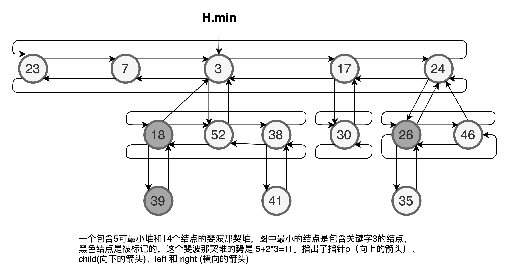

[TOC]


# 一、B树

## 1.1 B树的定义
一颗B树 T 是具有以下性质的有根树（根为 $T.root$）
1. 每个结点具有如下属性：
  a. $x.n$,当前存储在结点x中的关键字个数。
  b. $x.n$ 个关键字 $x.key_1, x.key_2, ... , x.key_{x.n}$, 以非降序存放，使得 
  $$
  x.key_1 \leqslant  x.key_2 \leqslant \dots \leqslant x.key_{x.n}
  $$
  c. $x.leaf$ , 布尔值，如果 $x$ 是叶结点，则为 `TRUE` ;如果 $x$ 是内部结点，则为 `FALSE`。
  
2. 每个内部结点 $x$ 还包含 $x.n+1$ 个其孩子结点的指针 $x.c_1, x.c_2, \dots, x.c_{x.n+1}$。叶结点没有孩子，所以它们的 $c_i$ 属性没有定义。

3. 关键字 $x.key_i$ 对存储在各个子树中的关键字范围加以分割： 如果$k_i$为任意一个存储在以 $x_{c_i}$为根的子树中的关键字，那么
   $$
   k_1 \leqslant x.key_1 \leqslant k2 \leqslant x.key_2 \leqslant \dots \leqslant x.key_{x.n} \leqslant k_{x.n+1}
   $$

4. 每个叶结点具有相同的高度，即树的高度$h$。

5. 每个结点所包含的关键字的个数有上界和下界。用一个被称为B树的**最小度数（Minimum Degree）** 的固定整数 $t \geqslant 2$ 表示这些界。

   a. 除了根结点以外的每个结点必须至少包含 $t-1$ 个结点。因此，除了根结点以外的每个内部结点都至少包含 $t$ 个孩子。如果树为非空，则至少有一个关键字。

   b. 每个结点最多可包含 $2t-1$ 个关键字。因此，一个内部结点至多可有 $2t$ 个孩子，当一个结点恰好有 $2t-1$ 个关键字时，称该结点时**满的（Full）**；

   > t=2时的B树是最简单的。每个内部结点有2个、3个或4个孩子，即一颗**2-3-4树**，然而在实际中，$t$越大，B树的高度就越小。

   **B树的高度**

   B树上大部分的操作所需要的磁盘读取次数与B树的高度是成正比的。

   **定理1.1** 如果 $n \geqslant 1$ ,那么对任意一棵包含$n$ 个关键字、高度为$h$、最小度数 $t\geqslant2 $的B树$T$ ，有
   $$
   h \leqslant \log_t \frac{n+1}{2}
   $$

## 1.2 B数的基本操作

`B-TREE-SEARCH, B-TREE-CREATE, B-TREE-INSERT`

假设：

* B树的根结点始终在主存中，这样无需对 根做 `DISK-READ` 操作;然而，当根结点被改变后，需要对根结点做一次 `Disk-Write` 操作。
* 任何被当作参数的结点在被传递之前，都要对它们先做一次 `DISK-READ` 操作。

下面给出的操作过程都是“单程的”，即它们从根开始向下，没有任何返回向上的过程。

### 1.2.1 搜索B树

`B-TREE-SEARCH` 的输入是一个指向某子树根结点 $x$ 的指针，以及要在孩子中搜索一个关键字$k$。如果$k$在 B 树中，则返回的是由结点$y$和 $y.key_i = k$  的下标 $i$ 组成的有序对$（y, i）$，否则该过程返回 $NIL$。

```
B-TREE-SEARCH(x, k):
	i=1
	while i <= x.n and k > x.key_i:
		i = i + 1
	if i <= x.n and k == x.key_i
		return (x, i)
	elseif x.leaf
		return NIL
	else DISK_REAK(x, c_i)
		return B-TREE-SEARCH(c_i, k)
```

算法复杂度分析：在递归的过程中所遇到的结点构成了一条从根到叶结点的路径。因此 `B-SEARCH-TREE` 的访问磁盘页面的页数为 $O（h）=O(\log_t{n})$ ,其中 h为B树的高度，n为B树中所含关键字的个数。由于 $x.n \leqslant 2t$ ,所以while循环所花的时间为 $O（t）$ 。

### 1.2.2 创建一棵空的B树

为创建一个B树T，用 `B-TREE-CREATE` 来创建一个空的根结点，然后调用`B-TREE-INSERT`添加新的关键字。过程用`ALLOCATE-NODE()`在$O（1）$的时间内为新建点分配一个磁盘页，该过程不需要进行 `DISK- READ`，因为磁盘上还没有关于该结点的有用信息。

```
B-TREE-CREATE(T)
	x = ALLOCATE-NODE()
	x.leaf = true
	x.n = 0
	DISK-WRITE(x)
	T.root = x
```

时间复杂度分析：需要$O(1)$的磁盘操作和$O(1)$的CPU时间。

### 1.2.3 向B树中插入一个关键字

1. 将一个关键字插入到一个已经存在叶结点上，由于不能直接插入到一个慢的叶结点上，故引入一个操作将一个满结点 $y$（包含 $2t-1$ 个关键字）按其中间关键字 $x .key_t$ **分裂（split）** 成两个各包含 $t-1$ 个关键字的结点。中间关键字提升到 $y$ 的父结点,以表示两颗新树的划分点。但是如果$y$ 的父结点也是满的，就必须在插入新的关键字之前将其分裂，最终满结点的分类会沿着树向上传播。
2. 与二叉搜索树一样，可以在从树根到叶结点这个单程向下的过程中过将一个新的关键字插入B树中。为了做到这一点，并不是在等到找出插入过程中实际要分类的满结点时才做分裂。而是当沿着树向下查找新关键字所属位置时，就分裂沿途遇到的每个满结点（包括叶结点本身）。因此，每当分裂一个满结点$y$时，就能确保他的父结点不是满的。

### 1.2.4 分裂B树中的结点

输入：一个非满的内部结点$x$（假定在主存中）和一个使 $x.c_i$ (假定也在主存中)为满子结点的下标$i$ ，该过程把这个结点分裂成两个，并调整$x$，使之包含多出的孩子。

要分裂一个满的根，首先要让根成为一个新的空结点的孩子，这样才能使用`B-TREE-SPLIT- CHILD`	。树的高度因此增加1； **分裂**是树长高的唯一途径。

```
B-TREE-SPLIT-CHILD(x, i):
	z = ALLOCATE-NODE()
	y = x.c_i
	z.leaf = y.leaf
	z.n = t-1
	for j= = 1 to t-1:
		z.key_j = x.key_{j+t}
	if not y.leaf
		for j = 1 to j
			z.c_j = y.c_{j+t}
	y.n = t-1
	for j = x.n+1 downto i+1
		x.c_{j+1} = x.c_j
	x.c_{i+1} = z
	for j = x.n downto i
		x.key_{i+1} = x.key_i
	x.key_i = y.key_t
	x.n = x.n+1
	DISK-WRITE(y)
	DISK-WRITE(z)
	DISK_WRITE(x)
```

复杂度分析：CPU时间 $\Theta(t)$ ，执行 $O(1)$次磁盘操作。

### 1.2.5 以沿树单程下行方式向B树插入关键字

一颗高度为$h$ 的 B树 $T$  中，以沿树单程下行方式插入一个关键字$k$ 的操作需要$O(h)$ 次磁盘存取。所需要的cpu时间为$O(th) = O(tlog_{t}n)$ 。过程 `B-TREE-INSERT` 利用 过程 `B-TREE-SPLIT-CHILD` 保证递归始终不会降至一个满结点上。

`if` 块中处理根结点r为满的情况：原来的根结点被分裂，一个新的结点s(有两个孩子)成为根。对根进行分裂时增加B树搞丢的唯一途径。（与二叉搜索树不同，B树高度的增加发生在顶部而不是底部）。过程调用 `B-TREE-INSERT-NONFULL` 完成关键字$k$ 插入非满的根结点为根的树中。 `B-TREE-INSERT-NONFULL` 在需要时沿树向下递归，在必要时通过调用 `B-TREE-SPLIT-CHILD` 来保证任何时候他所递归处理的结点都是非满的。

```
B-TREE-INSERT(T, k)
	r = T.root
	if r.n == 2t-1
		s = ALLOCATE-NODE()
		T.root = s
		s.leaf = FALSE
		s.n = 0
		s.c_1=r
		B-TREE-SPLIT-CHILD(s, 1)
		B-TREE-INSERT-NONFULL(s, k)
	else B-TREE-INSERT-NONFULL(r, k)
```

调用`B-TREE-INSERT-NONFULL` 完成将关键字$k$插入以非满的根结点为根的B树$x$中。 操作`B-TREE-INSERT` 和递归操作 `B-TREE-INSERT-NONFULL` 保证了这个假设成立。

```
B-TREE-INSERT-NONFULL(x, k)
	i = x.n
	if x.leaf
		while i >= 1 and k < x.key_i
			x.key_{i+1} = x.key_i
			i = i-1
		x.key_{i+1} = k
		x.n = x.n+1
		DISK-WRITE(x)
	else 
		while i >= 1 and k < x.key_i
			i = i-1
		i = i+1
		DISK-READ(x, c_i)
		if x.c_i.n == 2t-1
			B-TREE-SPLIT-CHILD(x, i)
			if k > x.key_i
				i = i+1
		B-TREE-INSERT-NONFULL(x.c_i, k)
		
```

复杂度分析：对于可以高为h的B树来说，`B-TREE-INSERT` 要做 $O(h)$ 次磁盘存取，因为每次调用`B-TREE-INSERT-NONFULL`之间，只做了$O（1）$ 次 `DISK-READ` 和 `DISK-WRITE` 操作。所占用的总CPU时间为$O(th) = O(log_{t}n)$ ,因为`B-TREE-INSERT-NONFULL` 时尾递归的，所以它也可以用一个while循环来实现，从而说明了在任何时刻，需要留在主存中的页面数为 $O(1)$。

## 1.3 从B树中删除关键字

```
B-SPLIT-DELETE(x, k)
```

过程 `B-SPLIT-DELETE` 从以 $x$ 为根的B树中删除关键字$k$。

1. 如果关键字$k$ 在结点$x$中，并且$x$时叶结点，则从$x$中删除$k$。

2. 如果关键字$k$ 在结点$x$中，并且$x$为内部结点，则做以下操作：

   a. 如果在结点 $x$ 中前于 $k$ 的子结点 $y$ 至少包含 $t$ 个关键字，则找出 $k$ 在以 $y$ 为根的子树中的前驱 $k'$ 。递归删除 $k'$ ，并在 $x$ 中用 $k'$ 中代替 $k$ 。（找到 $k'$ 并删除它可在沿树下降的单调过程中完成。）

    b. 对称地，如果 $y$ 有少于 $t$ 的关键字，则检查结点 $x$ 中后于 $k$ 的子结点 $z$ 。如果 $z$ 至少有 $t$ 个关键字，则找出 $k$ 在以 $z$ 为根的子树中的后继 $k'$ 。递归删除 $k'$，并在 $x$ 中用 $k’$ 代替 $k$  。(找到 $k'$ 并删除它可在沿树下降的单过程中完成。)

   c. 否则，如果 $y$ 和 $z$ 都只含有 $t-1$ 个关键字，则将 $k$ 和 $z$ 全部合并进 $y$ ,这样 $x$ 就失去了 $k$ 和指向 $z$ 的指针，并且 $y$ 现在包含了$2t-1$ 个关键字。然后释放 $z$ 并递归地从 $y$ 中删除 $k$。

3. 如果关键字 $k$ 当前不在内部结点 $x$ 中，则确定必包含 $k$ 的子树的根 $x.c_i$ (如果 $k$ 确实在树中)。如果 $x.c_i$  只有 $t-1$ 个关键字，必须执行步骤 3a 和 3b 来保证降至一个至少包含 $t$ 个关键字的结点。然后，通过 $x$ 的某个合适的子结点进行递归而结束。

   a. 如果 $x.c_i$ 只含有 $t-1$ 个关键字，但是它的一个相邻的兄弟至少包含 $t$ 个关键字，则将 $x$ 中的某一个关键字降至 $x.c_i$ 中，将 $x.c_i$ 的相邻左兄弟或右兄弟的一个关键字升至 $x$ ，将该兄中相应的孩子指针移动到 $x.c_i$ 中，这样就使得 $x.c_i$ 增加了一个额外的关键字。

   b. 如果 $x.c_i$ 以及 $x.c_i$ 的所有相邻兄弟都只包含 $t-1$ 个关键字，则将 $x.c_i$ 与一个兄弟合并，即将 $x$ 的一个关键字移至新合并的结点，使之成为该结点的中间关键字。

​		由于一颗B树中的大部分关键字都在叶结点中，我们可以预期在实际中，删除操作最经常用于从叶结点中删除关键字。这样 `B-TREE-DELETE` 过程沿树下降一趟即可，不需要向上回溯。然而，当要删除某个内部结点的关键字时，该过程也要沿树下降一趟，但可能还要返回删除了关键字的那个结点，以用其前驱或后继来替代被删除的关键字（情况2a, 2b）

时间复杂度分析：

​		对一颗高度为 $h$ 的B树，它只需要 $O(h)$ 次磁盘操作，因为在递归调用该过程之间，仅需 $O(1)$ 次对DISK-READ 和 DISK- WRITE 的调用。所需CPU时间为 $O(th) = O(tlog_{t}n)$。

# 二、斐波那契堆

斐波那契堆数据结构用途：

1. 支持一系列操作，这些操作构成了可合并堆。
2. 斐波那契堆的一些操作可以在常数摊还时间内完成，这使得这种数据结构非常适合于需要频繁调用这些操作的应用。

**可合并堆**（mergeable heap）是支持一下5中操作的的数据结构：

1. `MAKE-HEAP()` ，创建一个新的不含任何元素的堆。

2. `INSERT(H, x)`， 将一个以填入关键字的元素 `x` 插入到堆 `H` 中。

3. `MNIMUM(H)` ，返回一个指向 `H` 的最小值关键字的指针。

4. `EXTRACT_MIN(H)`， 从堆 `H` 中删除最小元素的值，并返回指向该元素的指针。

5. `UNION(H1, H2)`， 创建并返回一个包含堆 `H1` 和堆 `H2`中所有元素的新堆，堆 `H1` 和堆 `H2` 有这一操作“销毁”。

   除了以上5中操作，斐波那契堆还支持如下两种操作：

1. `DECREASE-KEY(H, x, k)` ， 将 `H`中的元素 `x` 的关键字赋予新值 `k` ,假定 `k`  不大于当前的关键字。
2. `DELETE(H, x)`，从堆 `H` 中删除元素 `x` 。

## 2.1 斐波那契堆结构

​		一个*斐波那契堆*是一系列具有**最小堆**(min-heap ordered)的有根树的集合，也就是说每棵树都满足最小堆的性质：每个结点的关键字都大于等于父结点的关键字。



​		每个结点 $x$ 包含一个指向它父结点的指针 $x.p$ 和一个指向它的某一个孩子的指针 $x.child$ ， $x$ 的所有孩子链接成一个环形状的双向链表，称为 $x$ 的**孩子链表**（child list），孩子链表中的每个孩子 $y$ 均有指针 $y.left$ 和 $y.right$ ,分别指向 $y$ 的左兄弟和右兄弟。如果 $y$ 是仅有的一个孩子，则 $y.left = y.right$ ，孩子链表中的兄弟结点顺序是任意的。

​		每个结点有另外两个属性。 $x.degree$ ， 布尔值属性 $x.mark$ 指示结点 $x$ 自从上一次成为另一个结点的孩子后，是否失去过孩子。新产生的结点是未被标记的，并且当结点 $x$ 成为另一个结点的孩子结点时，它便成为未被标记结点，直到操作 `DECRESE-KEY` 操作，才把所有的 $mark$ 属性设置为$False$ 。

​		通过指针 $H.min $ 来访问一个给定斐波那契堆 $H$ ，该指针指向具有最小关键字的树的根结点，我们把这个结点称之为斐波那契堆的**最小结点**（minimum node）。如果不止一个根结点具有最小关键字，那么这些根结点中的任何一个都有可能成为最小结点。如果一个斐波那契堆 $H$ 是空的，那么 $H.min$ 为 $NUL$ 。

​		另外斐波那契堆 $H$ 还有一个属性：$H.n$ ,表示 $H$ 中当前的结点数目。

## 2.2 可合并堆操作

#### 2.2.1 创建一个可新的斐波那契堆

#### 2.2.2 插入一个结点

#### 2.2.3 寻找最小结点

#### 2.2.4 两个斐波那契堆的合并

#### 2.2.5 抽取最小结点


## 2.3 关键字减值和删除一个结点

#### 2.3.1 关键字减值

#### 2.3.2 删除一个结点

## 2.4 最大度数的界

# 三、van Emade Boas 树

## 3.1 基本方法
### 3.1.1 直接寻址
### 3.1.2 叠加的二叉树结构
### 3.1.3 叠加的一颗高度恒定的树
## 3.2 递归结构
## 3.3 van Emade Boas 树及其操作

# 四、用于不相交集合的数据结构
> 一些应用设计将n个不同的元素分成一组不相交的集合。这些应用经常需要进行两种特别的操作：寻找包含特定元素的唯一集合和合并两个集合。本章节介绍如何维护一种数据结构来实现这些操作。
## 4.1 不相交集合的操作
## 4.2 不相交集合的链表表示
## 4.3 不相交集合森林

