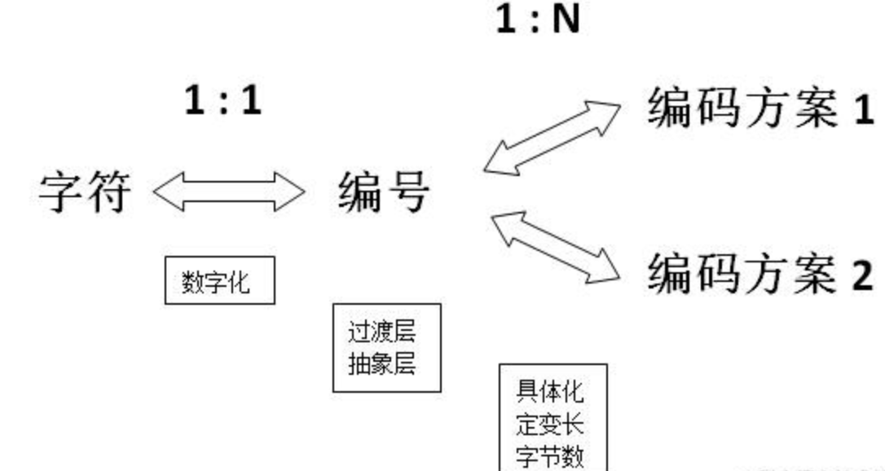
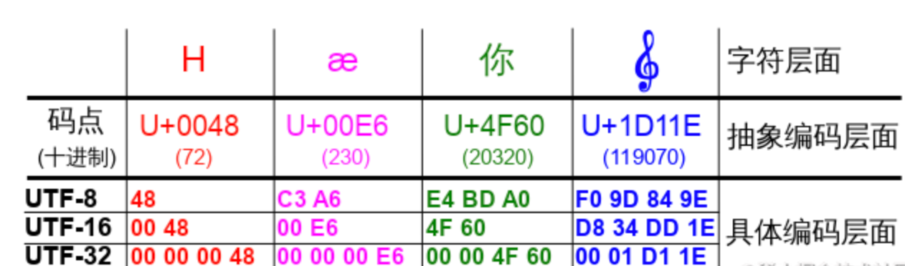
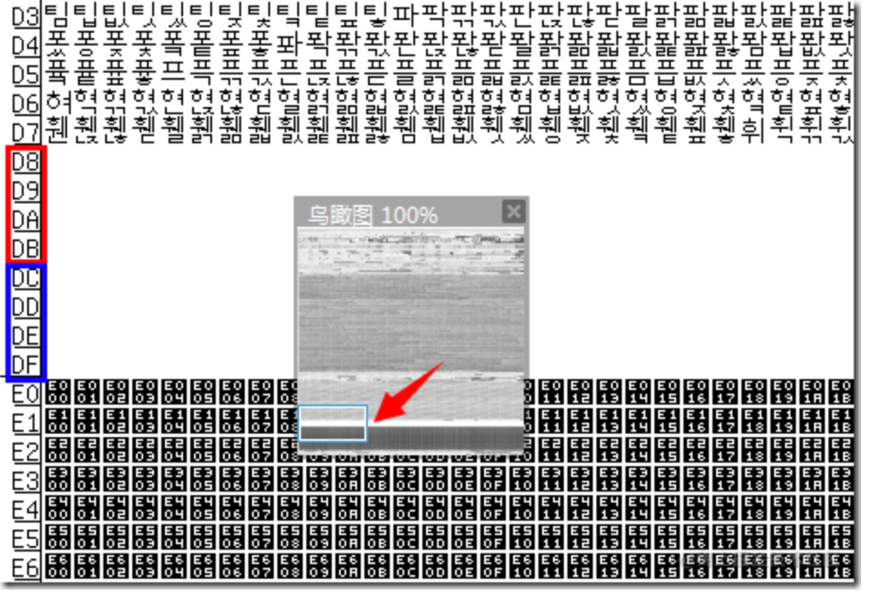
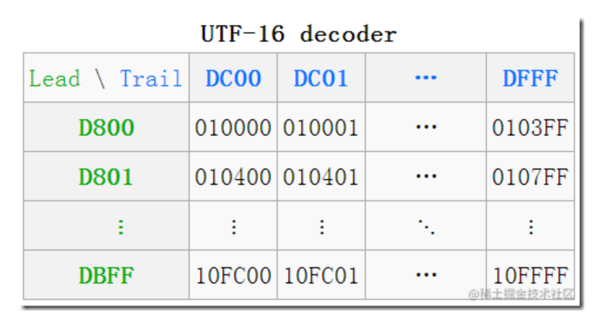
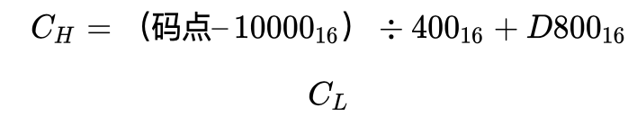
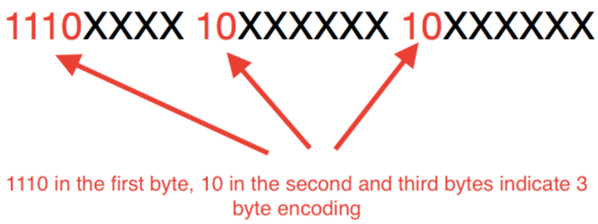

= 深入理解字符编码（ASCII、Unicode、UTF-8、UTF-16、UTF-32）

一个 char 字符或者一个 int 整数都会被转换成二进制码储存起来，这个过程可以被称为##编码##。

而将计算机底层的二进制码转换成屏幕上有意义的字符（如“hello world”），这个过程就称为##解码##。

在计算机中字符的编解码就涉及到 #字符集#（Character Set） 这个概念，他就相当于能够将一个字符与一个整数一一对应的一个##映射表##，常见的字符集有 ASCII、Unicode 等。

== https://en.wikipedia.org/wiki/ASCII[ASCII 编码]
从字符集对照表中可以看出，ASCII 字符集支持 128 种字符，仅使用 7 个 bit 位，也就是一个字节的后 7 位就可以将它们全部表示出来，而最前面的一位统一规定为 0 即可（如 0110 0001 表示 a）。

后来，为了能够表示更多的欧洲国家的常用字符如法语中带符号的字符 é，又制定了 ASCII 额外扩展的版本 EASCII，这里就可以使用一个完整子节的 8 个 bit 位表示共 256 个字符，其中就又包括了一些衍生的拉丁字母。

== 非 ASCII 编码
=== GB2312
=== GBK

== Unicode
集大成者 Unicode 字符集出现了，它将世界上所有的符号都纳入其中，成功实现了每个数字代表唯一的至少在某种语言中使用的符号，目前，Unicode 字符集中已经收录超过 13 万个字符（第十万个字符在2005年获采纳）。值得关注的是，Unicode 依然兼容 ASCII，即 0～127 意义依然不变。

=== 码点
Unicode 表示的是一个字符集，与我们通常所说的 UTF-8、UTF-6 等编码方式并不相同，本节介绍的编号就相当于 ASCII 码中的 ASCII 值，它就是 Unicode 字符集中唯一表示某个字符的标识，在 Unicode 也称作码点（Code Point），如码点 U+0061，这里的 61 就是 97 的十六进制表示，它就表示 Unicode 字符集中的字符 ‘a‘。
码点的表示的形式为 U+[XX]XXXX，X 代表一个十六制数字，一般可以有 4-6 位，不足 4 位前补 0 补足 4 位，超过则按是几位就是几位，具体范围是 U+0000~U+10FFFF，大概是 111 万。按 Unicode 官方的说法，码点范围就这样了，以后也不扩充了，一百多万足够用了，目前也只定义了 11 万多个字符左右。

=== Unicode 编码
Unicode 字符集衍生出来的编码方案有三种，分别是 UTF-32、UTF-16 和 UTF-8，这使他与之前的编码模式不同，因为 ASCII、GBK 等类编码模式的字符集和编码方式都是一一对应的，而 Unicode 的编码实现却有三种，这就是我们需要区分字符集与编码的原因之一，因为此时 Unicode 并不特指  UTF-8 或者 UTF-32。

上面表中包含了四个字符的码点，其中也展示了四个不同的码点在 UTF-32、UTF-16 和 UTF-8 三种编码模式下的编码结果。其中：码点到 UTF-32 的转换最简单，就是在前面填充 0 满 4 字节即可；码点到 UTF-8 的转换，除了最小那个在数值上一样外，其它三个完全看不出两者的关系；码点到 UTF-16 的转换则是最不规则的，可以看出前三个字符 UTF-16 与码点是完全一致的，但那个大码点（准确地说是超过了 U+FFFF 的码点）则有了很大的变化，长度变成了四字节，值也变得很不一样了。
这其中又涉及到编码过程中定长与变长两种实现方式，这里的 UTF-32 就属于定长编码，即永远用 4 字节存储码点，而 UTF-8、UTF-16 就属于变长存储，UTF-8 根据不同的情况使用 1-4 字节，而 UTF-16 使用 2 或 4 字节来存储码点。

=== 定长与变长
为什么要有定长于变长这两种编码形式？在中文的表达中都会有所谓的断句问题，如果我们处理不好断句很有可能会将意思传递错误。如下面这句来自算命先生纸条中的内容：

大富大贵没有灾难要小心

此时，如果算命侠客这样断句：

大富大贵，没有灾难要小心

表示我福大命大，没有灾难，可以肆意妄为了，但是没过多久这位侠客就去世了，算名先生绝望地说，你会错意了，原来，其实是这样断句的：

大富大贵没有，灾难要小心

表示你没有大富大贵，出门要小心，断句就可能会出现这样严重的后果。
这也是计算机在解码时需要使用定长与变长的原因。因为计算机底层的二进制码也和算命先生纸条中的内容一样，毫无章法，我们如果想要正确理解其中的意思就要有一个约定俗成的规则。

=== UTF-32
在 UTF-32 这种定长的编码方式下就表示每 4 个子节一个断句，那么字符 A 的码点 U+0041（二进制为 1000001）被 UTF-32 编码后就会变成如下形式存储在计算机中：

00000000 00000000 00000000 01000001

它会将 4 个字节中空出的高位全部填充为 0。这种表示的最大缺点是占用空间太大，因为不管都大的码点都需要四个字节来存储，非常的占空间，那么如何突破这个瓶颈呢？变长方案应运而生。

=== UTF-16
UTF-16 使用的是一种变长为 2 或 4 字节编码模式。

最初，Unicode1.0 被设计为纯 16 位编码，拥有 65,536 个码点（U+0000～U+FFFF），目的就是希望能够表示所有现代字符，然而随着时间推移，16 位对于计算机而言显然是不够的，因此产生了如今的 4 字节的 UTF-16 编码，此时，Unicode 就具有了 1,114,112 个代码点（U+10000 ～ U+10FFFF），这就是我们之前介绍 Unicode。

此时，范围在 U+0000～U+FFFF 的码点被称了为 **BMP（Basic Multilingual Plane，基本多语言平面）**，而后来拓展的范围 U+10000 ～ U+10FFFF 称为 **SP（Supplementary Planes，增补平面）**。UTF-16 就是利用 BMP 使用**代理**的方式来对字符进行编码。

> 何为代理？

代理和 UTF-8 中的高位保留的目的一样，就是为了能够实现变长的编码方式。

> 什么是代理区？

代理区由两个特殊范围（BMP 中的空闲部分）的 Unicode 码点组成，总共有 2048 个位置，均分为**高代理区**（D800–DBFF）和**低代理区**（DC00–DFFF）两部分，各 1024，这两个区可以组成一个二维的表格，共有 1,024 x 1,024 = 1,048,576 = 16×65536 个单元格，所以它恰好可以表示代理（增补）的 16 位中的所有字符。

这种从一维存储转换到二维存储的方式就可以实现空间增大的效果了，UTF-16 也就有了能够额外获得码点的方式了。

一个高代理区（即上图中的 Lead（头），行）的加一个低代理区（即上图中的Trail（尾），列）的编码组成一对**代理对（Surrogate Pair）**。在图中就可以看到一些转换的例子，如

（**D8 00** ***DC 00***）—>U+10000，左上角，第一个增补字符

（**DB FF** ***DF FF***）—>U+10FFFF，右下角，最后一个增补字符

> 从 UTF-16 转换为字符代码的算法是什么？

分成两部分：

1. BMP 中直接对应，无须做任何转换；

2. 增补平面 SP 中，则需要做相应的计算。其实由上图中的表也可看出，码点就是从上到下，从左到右排列过去的，所以只需做个简单的除法，拿到除数和余数即可确定行与列。

   拿到一个码点，先减去 10000，再除以 400（=1024）就是所在行了，余数就是所在列了，再加上行与列所在的起始值，就得到了代理对了。

=== UTF-8

UTF-8 属于变长的编码方式，它可以由 1，2，3，4 四种字节组合，使用的是高位保留的方式来区别不同变长，具体方式如下：

对于只有一个字节的符号，字节的第一位设为0，后面 7 位为这个符号的 Unicode 码。此时，对于英语字母UTF-8 编码和 ASCII 码是相同的。

对于 n 字节的符号（n > 1），第一个字节的前 n 位都设为 1，第 n + 1 位设为0，后面字节的前两位一律设为 10。剩下的没有提及的二进制位，全部为这个符号的 Unicode 码，如下表所示：

Unicode 码点范围（十六进制）
UTF-8 编码方式（二进制）
字节数

|===
|Unicode 码点范围（十六进制）	|UTF-8 编码方式（二进制）	 |字节数

|0000 0000 ～ 0000 007F
|0xxxxxxx
|一个字节

|0000 0080 ～ 0000 07FF
|110xxxxx 10xxxxxx
|二个字节

|0000 0800 ～ 0000 FFFF
|1110xxxx 10xxxxxx 10xxxxxx
|三个字节

|0001 0000 ～ 0010 FFFF
|11110xxx 10xxxxxx 10xxxxxx 10xxxxxx
|四个字节
|===

跟据上表，编码字符时就非常简单了，以汉字 “丑” 为例，它的码点为 0x4E11（0100 1110 0001 0001）在上表的第三行范围（0000 0800 ～ 0000 FFFF）内，因此 “丑” 需要以三个字节的形式编码：

