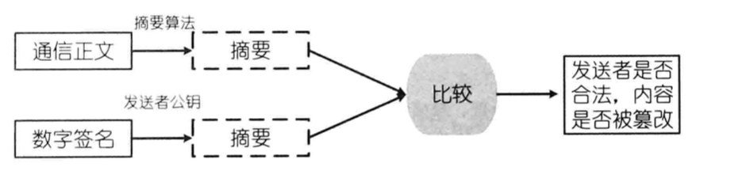

= 数字安全技术

== Base64编码
== 对称加密和非对称加密

=== 对称加密

- DES
- AES

=== 非对称加密
- RSA

== 数字签名
[sidebar]
.签名认证
--
签名认证是非对称加密技术和数字摘要技术的综合运用。指的是将通信内容的摘要信息使用发送的私钥进行加密，然后将秘文与原文一起传输给信息的接受者，接受者通过发送者的共钥解密被加密的摘要信息，然后使用与加密者相同的摘要算法，对接收到的内容采用相同的方式产生摘要串，与解密的摘要串进行对比，如果相同，则说明收到的内容是完整的，在传输的过程中没有被第三方篡改，否则说明通信内容已被第三方修改。

--

1. MD5withRSA

2. SHA1withRSA

[source,java]
.数字签名示例
----
class MD5withRSA_SHA1withRSA{
    public static void main(String[] args)  throws Exception {
        String content = "study hard and make progress everyday";
        System.out.println("content :"+content);

        KeyPair keyPair = getKeyPair();
        PublicKey publicKey =  keyPair.getPublic();
        PrivateKey privateKey = keyPair.getPrivate();

        String md5Sign  = getMd5Sign(content,privateKey);
        System.out.println("sign with md5 and rsa :"+ md5Sign);
        boolean md5Verifty = verifyWhenMd5Sign(content,md5Sign,publicKey);
        System.out.println("verify sign with md5 and rsa :"+ md5Verifty);

        String sha1Sign  = getSha1Sign(content,privateKey);
        System.out.println("sign with sha1 and rsa :"+ sha1Sign);
        boolean sha1Verifty = verifyWhenSha1Sign(content,sha1Sign,publicKey);
        System.out.println("verify sign with sha1 and rsa :"+ sha1Verifty);

    }

    //生成密钥对
    static KeyPair getKeyPair() throws Exception {
        KeyPairGenerator keyGen = KeyPairGenerator.getInstance("RSA");
        keyGen.initialize(512); //可以理解为：加密后的密文长度，实际原文要小些 越大 加密解密越慢
        KeyPair keyPair = keyGen.generateKeyPair();
        return keyPair;
    }

    //用md5生成内容摘要，再用RSA的私钥加密，进而生成数字签名
    static String getMd5Sign(String content , PrivateKey privateKey) throws Exception {
        byte[] contentBytes = content.getBytes("utf-8");
        Signature signature = Signature.getInstance("MD5withRSA");
        signature.initSign(privateKey);
        signature.update(contentBytes);
        byte[] signs = signature.sign();
        return Base64.getEncoder().encodeToString( signs );
    }

    //对用md5和RSA私钥生成的数字签名进行验证
    static boolean verifyWhenMd5Sign(String content, String sign, PublicKey publicKey) throws Exception {
        byte[] contentBytes = content.getBytes("utf-8");
        Signature signature = Signature.getInstance("MD5withRSA");
        signature.initVerify(publicKey);
        signature.update(contentBytes);
        return signature.verify(Base64.getDecoder().decode(sign));
    }

    //用sha1生成内容摘要，再用RSA的私钥加密，进而生成数字签名
    static String getSha1Sign(String content , PrivateKey privateKey) throws Exception {
        byte[] contentBytes = content.getBytes("utf-8");
        Signature signature = Signature.getInstance("SHA1withRSA");
        signature.initSign(privateKey);
        signature.update(contentBytes);
        byte[] signs = signature.sign();
        return Base64.getEncoder().encodeToString( signs );
    }

    //对用md5和RSA私钥生成的数字签名进行验证
    static boolean verifyWhenSha1Sign(String content, String sign, PublicKey publicKey) throws Exception {
        byte[] contentBytes = content.getBytes("utf-8");
        Signature signature = Signature.getInstance("SHA1withRSA");
        signature.initVerify(publicKey);
        signature.update(contentBytes);
        return signature.verify(Base64.getDecoder().decode(sign));
    }
}
----

== 数字证书
[sidebar]
.数字证书
--
数字证书（Digital Certificate）也称为电子证书，类似与生活中的身份证，也是另一种形式的身份证，用于表示网络中的用户身份。
数字证书集合了多种密码学的加密算法，证书自带公钥信息，可以完成想要的加密、解密操作，同时，还拥有自身信息的数字签名，可以鉴别证书的颁发机构，以及证书内容的完整性。由于证书本身含有用户的认证信息，因此可以作为用户身份识别的依据。

通常数字证书包含如下内容：::
* 对象的名称（人、服务器、组织）
* 证书的过期时间
* 证书的颁发机构（谁为证书担保）
* 证书颁发机构对对证书信息的数字签名(鉴别颁发机构+内容是否完整)
* 签名算法
* 对象的公钥（对信息进行加密，信息传输到接受方，接收方将使用公钥对的私钥进行解密）
--

=== 1. X.509

=== 2. 证书签发
=== 3. 证书校验
=== 4. 证书管理

(1) keytool 用于数字证书的生成、导入、导出与撤销等操作。::
1) 构建自签名证书
2) 证书导出
3) 导出CSR
4) 导入数字证书

(2) OpenSSL::

1) OpenSSL 介绍
2) OpenSSL 安装
3) 配置OpenSSL 
4) 生产OpenSSL根证书 
5) OpenSSL签发服务端证书 
6) OpenSSL签发客户端证书

=== 5. 证书的使用

== 摘要认证
=== 1 为什么需要认证
防止在通信过程中，数据被中途拦截和修改；
防止虚假的客户端冒充正常的客户端发起请求；
防止客户单与虚假服务端进行通信，将个人信息泄露给恶意的攻击者。
需要对请求和响应的参数以及客户端的身份或服务端的身份进行认证，以确保正确发送给了合法的接受者。

=== 2 摘要认证的原理
摘要算法的不可逆性，防止信息篡改，摘要算法的安全性取决于 "盐" secret，由于服务端和客户端采用的是相同的secret，一旦secret泄露，通行的安全则无法保障。

=== 3 摘要认证的实现
//[plantuml]
//----
//
//----

== 签名认证
=== 原理
采用的非对称加密算法。
加密时使用的时私钥，而解密时使用的时对外公开的公钥，私钥由私钥持有者保管，不需要泄漏给第三方，安全性大大提高。
但相较于摘要认证，签名认证所使用的非对称加密算法将消耗更多的时间和硬件资源。

如何保证公钥的安全性，如何避免中间人攻击？

=== 实现

[plantuml]
.客户端请求数字签名
----
start
:请求参数;
:1. 参数排序;
:2. 将参数串接起来生成待摘要字符串;
:3. 使用MD5、SHA-1等摘要算法生成摘要串;
:4. 使用客户端的私钥对摘要串加密;
:数字签名;
end
----

[plantuml]
.服务端请求数字签名
----
@startuml
:请求参数;
:1. 参数排序;
:2. 将参数串接起来生成待摘要字符串;
:3. 使用MD5、SHA-1等摘要算法生成摘要串;
:4. 使用客户端的公钥对接收到的数字签名解密，得到客户端传递的摘要串;
:5. 比较解密的客户端摘要串与服务端生成的摘要串是否一致;
:客户端省份及内容是否被篡改;
@enduml
----

[plantuml]
.服务端响应签名生产
----
start
:请求参数;
:1. 将响应内容排序并生成待摘要字符串;
:2. 使用MD5、SHA-1等摘要算法生成摘要串;
:3. 使用服务端的私钥对摘要串加密;
:数字签名;
end
----

[plantuml]
.客户端响应签名校验
----
start
:响应内容;
:1. 响应内容作为摘要字符串;
:2. 使用与服务端相同的摘要算法（MD5、SHA-1等）生成摘要串;
:3. 使用服务端的公钥对摘要串解密;
:4. 比较解密后的摘要串与客户端生产的摘要串是否一致;
:服务端身份及内容是否别篡改;
end
----

== HTTPS协议

产生背景：
1. http协议校验简单，数据为明文传输，中间人可以通过劫持网络数据（网络嗅探），分析铭感数据（用户名、密码）影响网络安全。
2. 通过摘要认证可以防止数据被篡改，但是数据也是已明文方式传输。

HTTPS 设计目标：

(1)数据保密性 (2)数据完整性 (3)身份校验安全性
//NOTE:
//TIP
//IMPORTANT
//CAUTION
//WARNING

=== HTTPS协议的原理

创新点：创造性使用了非对称机密算法，在不安全的网络上安全传输了用来对称加密的密钥，综合利用了非对称加密的保密性和对称机密的快速性。

=== SSL/TLS

=== 部署HTTPS web

== OAuth协议
OAuth协议为用户资源的授权方式提供一个安全、开发的标准。平台商通过 OAuth 协议，提示用户对第三方软件厂商（ISV）进行授权，使得第三方软件厂商能够
使用平台商的部分数据，对用户提供服务。与以往的授权方式不同， OAuth协议并不需要触及用户的账户信息，即用户名密码，便可完成第三方对用户访问的授权。

=== OAuth协议产生的背景

=== OAuth授权过程